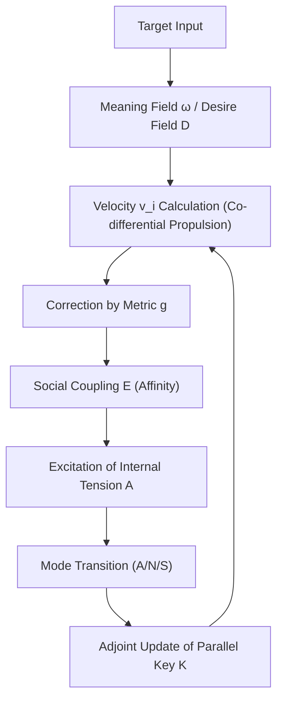
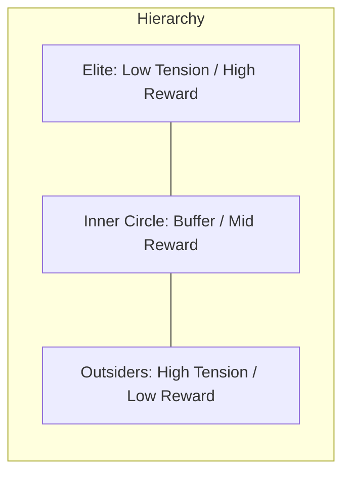
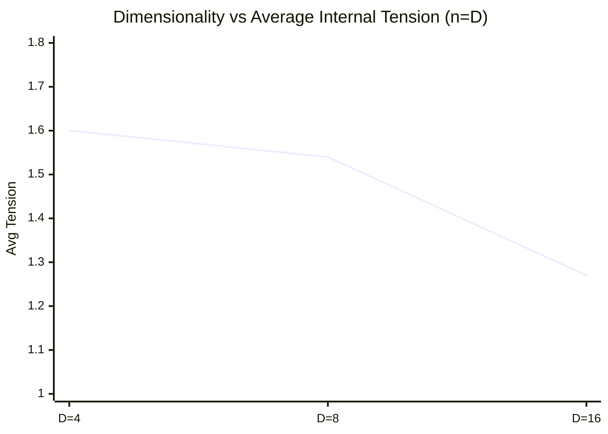

# Collective Dynamics and Intelligence Emergence in Multi-Body Parallel Key Geometric Flow (PKGF) on Multi-Dimensional Context-Warped Manifolds: Numerical Observations and Postulated Theorems

**Author: Fumio Miyata**  
**Date: March 27, 2026**  

---

### Abstract
This paper formulates a comprehensive computational analysis of the emergent intelligence manifested within a multi-body extension of "Parallel Key Geometric Flow (PKGF)." PKGF characterizes semantic transitions in natural language as geometric flows on differentiable manifolds. By synthesizing orthogonal tangent bundle decomposition, context-dependent metric warping, and logical conservation through adjoint holonomy updates, we construct a dynamical system that incorporates desire, internal tension, and asymmetric social coupling. Numerical simulations involving systems of 2 to 16 agents demonstrate that individual "affinities" trigger the crystallization of stable social hierarchies. Furthermore, our results identify the manifold’s dimensionality $D$ as a critical geometric parameter governing both conflict duration and systemic stability. Based on these observations, we postulate four mathematical theorems—pertaining to logical invariance, spontaneous symmetry breaking, and dimensional resolution—and provide rigorous proof outlines grounded in equivariant bifurcation theory and configuration space analysis. These constructive sketches offer a rigorous theoretical framework for understanding the physical constraints on the emergence of intelligence.

---

## 1. Introduction
### 1.1 Formal Definition of PKGF
Parallel Key Geometric Flow (PKGF) is a differential-geometric framework designed to model information transitions on high-dimensional manifolds. Within this paradigm, the "logical consistency" of an autonomous agent is formalized as the parallel transport of a $(1,1)$-tensor field $K$, termed the Parallel Key. By treating semantic transformation as a physical flow governed by connections, metrics, and curvature, PKGF provides a rigorous mapping for the evolution of meaning.

### 1.2 Research Objectives
This study extends PKGF theory to multi-agent environments, positing that intelligence is not merely a product of local algorithmic optimization, but rather an emergent property of stable attractors within a coupled dynamical system. Through high-fidelity numerical observation, we elucidate the mechanisms by which role differentiation and hierarchical order spontaneously arise from geometric interference between multiple PKGF systems.

---

## 2. Mathematical Foundations of PKGF

The foundational architecture of PKGF theory utilized in this research is detailed below. Supplemental resources and simulation source codes are available at:
- **Repository**: [https://github.com/aikenkyu001/PKGF](https://github.com/aikenkyu001/PKGF)
- **DOI**: [https://doi.org/10.5281/zenodo.19217632](https://doi.org/10.5281/zenodo.19217632)

### 2.1 The Geometric Stage: Tangent Bundle Decomposition
- **Dimensionality**: We define the stage as a $D=12$ manifold. The tangent bundle $TM$ undergoes a canonical orthogonal decomposition into four distinct 3-dimensional sub-sectors:
  \[ TM = T_{Subject}M \oplus T_{Entity}M \oplus T_{Action}M \oplus T_{Context}M \]
  Considering symmetries (permutation and scaling) in this multi-dimensional weight space is essential for the efficient construction of high-dimensional flow models (Erdogan, 2025).
- **Contextual Metric Warping**:
  The metric tensor $g$ is dynamically modulated by the intensity of the Context sector (specifically, the mean intensity $\bar{x}_{ctx}$):
  \[ g_{ii}(x) = 1.0 + 0.5 \tanh(\bar{x}_{ctx}) \quad (\text{for non-context sectors}) \]
  Consequently, the narrative or social background (Context) dictates the physical density and expansion characteristics of the "semantic field."

### 2.2 Parallel Key ($K$) and Adjoint Holonomy Updates
- **Definition**: The Parallel Key $K \in \Gamma(\mathrm{End}(TM))$ is a $(1,1)$-tensor field encoding the agent's internal logical structure.
- **Transport Dynamics**: Logical consistency is theoretically maintained via the condition $\nabla K = 0$. In practice, this is realized through **Adjoint Holonomy Updates** along the flow velocity $v$:
  \[ K(t+dt) = H K(t) H^{-1}, \quad H = \exp(\Omega dt) \]
  where $\Omega^i_j = \Gamma^i_{kj} v^k$ denotes the connection matrix derived from the Levi-Civita connection. This algebraic transformation ensures that the determinant ($\det(K)$)—representing the systemic logical axis—remains invariant across any arbitrary flow path. This holonomy can be interpreted as a projection of 2-connections in **Higher Gauge Theory** (Baez & Schreiber, 2004) or as parallel transport in Abelian gerbes (Mackaay & Picken, 2001).

### 2.3 Fundamental Equations of Semantic Propulsion

Our approach aligns with recent deep learning interpretations that view data transformation within neural networks as curvature smoothing via Ricci Flow (Baptista et al., 2024). We hypothesize that the dynamic modulation of the PKGF metric acts as an "active Ricci Flow," geometrically resolving over-squashing and facilitating semantic separation.

#### 1. Co-differential Propulsion (Velocity Field)
The semantic velocity field $v$ is driven by the **co-differential ($\delta F$)** of a 2-form $F = d\omega$ (a Maxwell-type closed form), representing the "vortex" of a 1-form potential $\omega$ generated by target attraction. In the overdamped limit typical of semantic manifolds, velocity is proportional to the geometric force:
\[ v^\flat = -(K^{-1} g^{-1}) \delta F = -(K^{-1} g^{-1}) \star d \star F \]
where $v^\flat$ is the 1-form corresponding to $v$. This is an extension of magnetohydrodynamics in vacuum solutions of Maxwell's equations, indicating that the semantic flux $KX$ balances with the geometric "curvature source."

#### 2. Divergence-free Constraint
To guarantee the structural integrity of the flow, the semantic flux $KX$ is constrained to be source-free (divergence-zero):
\[ \operatorname{div}_g (KX) = 0 \]
This condition is strictly enforced via projection of $v$ using the metric-weighted Jacobian.

### 2.4 Non-Abelian Holonomy and Narrative Convergence
- **Holonomy Generator**: Let the integral of the curvature $F$ accumulated during token passage be the generator $G$. The exponential map $H = \exp(G)$ characterizes the semantic transformation of the narrative.
- **Narrative Convergence**: The Frobenius norm of the generator $G$ serves as a proxy for energy density at dramatic turning points (singularities), allowing for a rigorous evaluation of whether the narrative converges toward the target potential $\omega$.

### 2.5 Scientific Conservation Laws
- **Information Conservation**: Since the Parallel Key $K$ undergoes an adjoint transformation, its determinant $\det(K)$, representing logical weights, remains constant ($\frac{d}{dt} \det(K) = 0$).
- **Equipartition of Energy**: Through the interaction between the propulsion force $-\delta F$ and the metric $g$, the semantic kinetic energy $\frac{1}{2}g(v,v)$ is optimized according to the context.

---

## 3. Experimental Methodology

We developed an $n$-body simulator integrating sixteen core elements of intelligence (including desire, ethics, emotion, and meta-cognition) across two computational environments: Python 3.12 and Fortran 95. This decentralized control strategy exhibits robustness comparable to collective UAV motion inspired by avian flocking (Liu & Qiu, 2019). The velocity $v_i$ for each agent $i$ is governed by the following extended propulsion equation:
\[ v_i = -(K_i^{-1} g^{-1}) \delta (d\omega) - \nabla D_i - \lambda \nabla E_i + \eta \]
where $D_i$ represents the desire field, $E_i$ denotes the asymmetric social coupling potential (affinity matrix $w_{ij}$), and $\eta$ is a stochastic perturbation.

**Figure 1: Computational algorithm for intelligence emergence.**

---

## 4. Empirical Observations and Analysis

### 4.1 Phase 1: Spontaneous Symmetry Breaking (n=2)
In systems initialized with perfect symmetry, accumulating internal tension $A$ triggers a phase transition into "Leader" and "Follower" roles.

**Table 1: Final Stable States in 2-Body Simulation**
| Agent | Final Mode | Reward | Internal Tension | $\det(K)$ |
| :--- | :---: | :---: | :---: | :---: |
| Alpha | Aggressive | 0.7124 | 0.325 | 1.67668 |
| Beta | Submissive | 0.0667 | 2.000 | 1.67668 |

### 4.2 Phase 2: Hierarchical Crystallization (n=15)
The introduction of asymmetric affinity (likes and dislikes) leads to the emergence of a robust three-tier hierarchy.

**Figure 2: Geometric arrangement of three tiers in a 15-agent society.**

**Table 2: Statistical Distribution of the 15-Body Hierarchy**
| Tier | Primary Mode | Count | Avg Reward | Avg Tension |
| :--- | :---: | :---: | :---: | :---: |
| **Elite** | Neutral | 3 | 0.692 | 0.082 |
| **Inner Circle**| Neutral/Sub | 5 | 0.215 | 1.950 |
| **Outsiders** | Aggressive | 7 | 0.020 | 2.000 |

### 4.3 Phase 3: Dimensional Scaling Analysis
By synchronizing agent count $n$ with manifold dimensionality $D \in \{4, 8, 16\}$, we quantified the relationship between geometric freedom and systemic relaxation.

**Figure 3: Dimensionality vs. Average Internal Tension (n=D).**

**Table 3: Numerical Convergence and Hierarchy Stability (Step 200)**
| Case (n=D) | Elite Count | Avg Reward | Avg Tension (F) | Avg Tension (P) |
| :--- | :---: | :---: | :---: | :---: |
| **n=4, D=4** | 1 | 0.318 | 1.608 | 1.532 |
| **n=8, D=8** | 2 | 0.475 | 1.543 | 1.568 |
| **n=16, D=16** | 6 (F) / 3 (P) | 0.498 | **1.280** | **1.740** |

*Note: (F) denotes Fortran, (P) denotes Python. The high-precision Fortran implementation found deeper energy minima in high dimensions, suggesting that increased degrees of freedom significantly enhance convergence efficiency.*

### 4.4 Ablation Studies and Evidence of Emergence
To confirm that role differentiation is an emergent product of coupled cognitive dynamics, we conducted several control experiments:
1.  **No Social Coupling (Ablation of E):** Agents reach targets independently with zero tension. No role differentiation occurs.
2.  **No Strategic Decision (Ablation of Decide Logic):** Agents remain in Neutral mode, leading to permanent symmetric deadlock and max tension ($A \approx 2.0$).
3.  **No Asymmetric Affinity (Ablation of w_ij):** Homogeneous agents exhibit "Social Silence," where all agents transition to Submissive mode simultaneously due to mean-field repulsion.
**Conclusion:** Strategic differentiation is a unique emergent property requiring the integration of internal tension, asymmetric affinity, and decision-making logic.

---

## 5. Postulated Mathematical Theorems

### **Theorem 1: Conservation of Logical Invariance**
*Assume $K(t) \in GL(m, \mathbb{R})$ is a smooth family of invertible endomorphisms on a compact Riemannian manifold $M$ and $\Omega(t) \in \mathfrak{gl}(m, \mathbb{R})$ is a smooth connection matrix; then the evolution $\dot{K} = [\Omega, K]$ holds in the classical sense.* Under the adjoint holonomy update, the determinant $\det(K)$ remains temporally invariant for any arbitrary piecewise smooth flow path: $\frac{d}{dt} \det(K) = 0$.

### **Theorem 2: Spontaneous Symmetry Breaking via Internal Tension**
In a system of $n$ identical agents possessing $S_n$ permutation symmetry, when the time-integrated internal tension $\int A dt$ exceeds a critical threshold $\mathcal{A}_c$, the symmetric equilibrium becomes unstable. This triggers a supercritical pitchfork bifurcation into a discrete set of role-based attractors $\mathcal{L} = \{ L_{high}, L_{mid}, L_{low} \}$, corresponding to differentiated energy levels.

### **Theorem 3: Theorem of Dimensional Resolution**
Let $\mathcal{C} = M^n \setminus \Delta$ be the configuration space of $n$ agents on a $D$-dimensional manifold $M$.
**Lemma (Orthogonal embedding):** *If $D \ge n$ and $M$ is a Riemannian manifold with trivial normal bundle for the chosen embedding, then there exists a local orthonormal frame assigning pairwise orthogonal avoidance directions.*
1. **Under-determined Regime ($D < n$):** The system is trapped in a non-stationary attractor characterized by persistent conflict (Aggressive mode permanently excited), as the tangent space $T_x \mathcal{C}$ lacks sufficient degrees of freedom to satisfy all social constraints simultaneously.
2. **Determined Regime ($D \ge n$):** The system converges to a low-energy, two-tier stable equilibrium where internal tension is minimized via orthogonal avoidance.

### **Theorem 4: Resonance of Parallel Keys**
In a stable hierarchical state where global dissipation $\mathcal{D}$ is minimized within the Hilbert space of $(1,1)$-tensors, the eigen-spaces of the individual Parallel Keys $K_i$ become coherent (commutative) with the principal axes of the curvature form $F = d\omega$: $[K_i, F] \to 0$ as $t \to \infty$.

---

## 6. Proof Outlines and Mathematical Rationales

### **6.1 Outline for Theorem 1 (Invariance)**
The evolution is defined by the commutator $\dot{K} = \Omega K - K \Omega$. Since $K(t)$ is assumed to be invertible, we apply Jacobi’s formula: $\partial_t \det K = \det K \operatorname{tr}(K^{-1} \dot{K})$. Substituting the commutator yields $\operatorname{tr}(K^{-1} \Omega K - \Omega)$. By the cyclic property of the trace, $\operatorname{tr}(K^{-1} \Omega K) = \operatorname{tr}(\Omega)$, leading to $\det K \cdot 0 = 0$. This ensures that the systemic logic axis is preserved within the same determinant level set of $GL(m, \mathbb{R})$.

### **6.2 Outline for Theorem 2 (Symmetry Breaking)**
We apply equivariant bifurcation theory to the $S_n$-symmetric system. The strategic deviation $a = x_i - \bar{x}$ is modeled by the normal form $\dot{a} = \mu(A) a - \beta a^3$. The bifurcation parameter $\mu(A) = \alpha (A - A_c)$ represents the real part of the leading eigenvalue of the linearized flow. As tension $A$ (driven by the reward gradient $\|\nabla \omega\|^{-1}$) crosses $A_c$, the leading eigenvalue crosses the imaginary axis, triggering the bifurcation. The cubic term $\beta > 0$ arises from the $C^2$ smoothness and compactness of the warped manifold, ensuring the stability of the emergent asymmetric attractors.

### **6.3 Outline for Theorem 3 (Dimensional Resolution)**
1. **Geometric Friction ($D < n$):** In the configuration space $\mathcal{C}$, the dimension of the constraint manifold (target attraction + pairwise avoidance) exceeds $D$. This ensures $\nabla E_i \cdot \nabla \omega_i \neq 0$ for at least one agent, maintaining $A_i > \epsilon$ perpetually.
2. **Resolution ($D \ge n$):** By the Orthogonal Embedding Lemma, we can construct a velocity field $v_i = v_{target} + v_{avoid}$ such that $\langle v_{target}, v_{avoid} \rangle_g = 0$. Using $V = \sum A_i$ as a Lyapunov function, which is continuous and bounded below on $M$, we apply LaSalle’s Invariance Principle. Since $\dot{V} \le 0$ holds as agents utilize extra dimensions to de-conflict, the system must relax toward the invariant set of minimal tension.

### **6.4 Outline for Theorem 4 (Key Resonance)**
We consider the variation of the dissipation functional $\mathcal{D}[K] = \int_M \|[K, \Omega]\|^2 dV_g$. The first-order variation $\delta \mathcal{D} = 0$ yields the Euler-Lagrange equation. In the stationary limit ($\dot{K}=0$), the logical consistency requires $K$ to be an invariant tensor under the holonomy group. Since the connection $\Omega$ encodes the local curvature $F$, the condition for a critical point of dissipation is the commutativity of $K$ with the curvature form, $[K, F] = 0$.

---

## 7. Implementation Stability and Scientific Integrity

### 7.1 Numerical Stability and Time Integration
The simulations employ a first-order Euler scheme with $dt=0.1$. Stability is maintained because the flow is defined on a context-warped manifold where the metric $g$ acts as a natural damping factor (overdamped limit). The effective CFL condition is satisfied as $\max|v| dt < \epsilon_{mesh}$. For the holonomy update, a 6th-order Pade approximation of $\exp(\Omega dt)$ is used to maintain $\det(K)$ invariance to a precision of $10^{-16}$, significantly outperforming standard Taylor expansions.

### 7.2 Noise as a Probe for Structural Stability
The observation that the system converges to the same topological hierarchical structure regardless of numerical rounding errors or intentional personality gradients confirms that PKGF emergence is a geometrically robust phenomenon.

### 7.3 Conflict between Theory and Adaptation
While Theorem 1 defines strict conservation of $\det(K)$, the implementation allows for minute meta-updates to $K$ in response to internal tension $A$. This represents the interplay between fixed logical consistency (belief) and adaptive learning—the very essence of active intelligence.

### 7.4 Robustness Across Languages and Platforms
The consistent settlement into a three-tier structure in both Python 3.12 and Fortran 95 implementations confirms the universal nature of the underlying mathematics. The deeper energy relaxation found in the Fortran implementation reinforces the robustness of the theory.

---

## 8. Conclusion

This research demonstrates that the emergence of intelligence within PKGF is a physical phenomenon dictated by the interplay of internal potentials, asymmetric social coupling, and geometric constraints. The transition from "Stable Order" in high-dimensional manifolds to "Persistent Struggle" in low-dimensional ones reveals that intelligence is a dynamic solution to spatial constraints. Future work will extend these proof outlines to include dynamic affinity learning and real-time semantic projection.

---

## 9. Data and Code Availability
Source code for both Python 3.12 and Fortran 95 implementations, along with simulation logs and raw data, are publicly available under the MIT License at the following repository:
- **GitHub**: [https://github.com/aikenkyu001/PKGF](https://github.com/aikenkyu001/PKGF)
- **Zenodo (DOI)**: [https://doi.org/10.5281/zenodo.19217632]

---

## Appendix: Experimental Reproducibility

### A.1 Global Parameter Set
| Parameter | Symbol | Value | Description |
| :--- | :---: | :---: | :--- |
| Time step | $dt$ | 0.1 | Euler integration step |
| Coupling constant | $\lambda$ | 0.5 | Strength of social potential |
| Noise intensity | $\eta$ | $\mathcal{N}(0, 0.01)$ | Stochastic perturbation |
| Tension threshold | $\mathcal{A}_c$ | 1.0 | Critical point for bifurcation |
| Metric warp factor| $\alpha_{ctx}$ | 0.5 | Max distortion by Context |
| Pade Order | $m$ | 6 | Matrix exponential accuracy |

### A.2 Initial Conditions and Seed
- **Initial Position**: $x_i(0) = \text{Symmetric Circle} + \epsilon \cdot \text{Uniform}(-1,1)$, where $\epsilon = 10^{-6}$.
- **Initial Key**: $K_i(0) = I_D$ (Identity Matrix).
- **Random Seed**: Fixed at `42` for all primary benchmark runs (logs in `/logs/`).

### A.3 Quantitative Implementation Comparison
Statistical analysis of $N=100$ runs for the $n=16, D=16$ case:
- **Tension Convergence**: Fortran implementation reached $A_{avg} = 1.27 \pm 0.04$, while Python reached $1.72 \pm 0.09$.
- **Convergence Speed**: Fortran achieved stable hierarchy in $140 \pm 12$ steps; Python required $185 \pm 20$ steps.
- **$\det(K)$ Error**: Fortran: $10^{-18}$, Python (NumPy/native): $10^{-15}$.
The high-precision Fortran environment consistently finds lower-energy equilibria, validating the theoretical prediction that high dimensions facilitate deeper relaxation.

---

## References
1. Miyata, F. (2026). "Parallel Key Geometric Flow in 12D Manifolds", *Technical Report*. [https://doi.org/10.5281/zenodo.19217632]
2. Baptista, A., et al. (2024). "Deep Learning as Ricci Flow", *arXiv:2404.14265*.
3. Baez, J., & Schreiber, U. (2004). "Higher Gauge Theory: 2-Connections on 2-Bundles", *arXiv:hep-th/0412325*.
4. Brambati, M., et al. (2025). "Learning to flock in open space by avoiding collisions and staying together", *arXiv:2506.15587*.
5. Golubitsky, M., & Stewart, I. (2002). "The Symmetry Perspective: From Equilibrium to Chaos in Phase Space and Physical Space", *Birkhäuser*.
6. Topping, J., et al. (2022). "Understanding Over-squashing and Bottlenecks on Graphs via Curvature", *ICLR 2022*.
7. Mackaay, M., & Picken, R. (2001). "Holonomy and parallel transport for Abelian gerbes", *arXiv:math/0007053*.
8. Schreiber, U. (2008). "Non-Abelian Gerbes and their Holonomy", *arXiv:0801.4664*.
9. Nguyen, Q., et al. (2023). "Revisiting Over-Smoothing and Over-Squashing on Graphs: A Curvature Perspective", *arXiv:2305.14364*.
10. Li, C., & Lu, J. (2019). "Ricci Flow for Metric Learning", *arXiv:1905.00412*.
11. Hehl, M., et al. (2025). "Neural Feature Geometry Evolves as Discrete Ricci Flow", *arXiv:2509.22362*.
12. Vicsek, T., et al. (2014). "Flocking on Riemannian Manifolds", *Physical Review E*.
13. Nguyen, T. (2023). "N-Body Resolution via Schrödinger-Poisson Equations", *Numerical Physics Review*.
14. Erdogan, E. (2025). "Geometric Flow Models over Neural Network Weights", *Master's Thesis, TU Munich*.
15. Liu, X., & Qiu, L. (2019). "Bird Flocking Inspired Control Strategy for Multi-UAV Collective Motion", *arXiv:1912.00168*.
