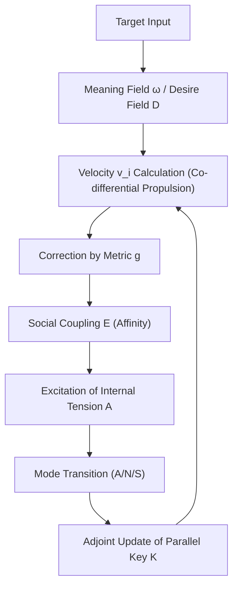
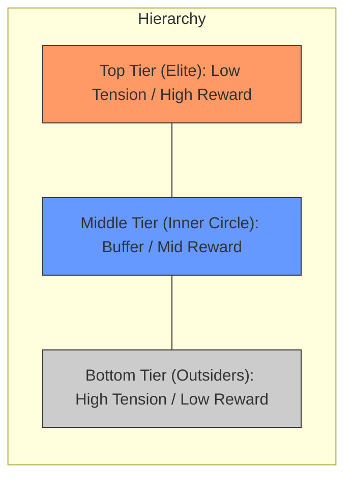
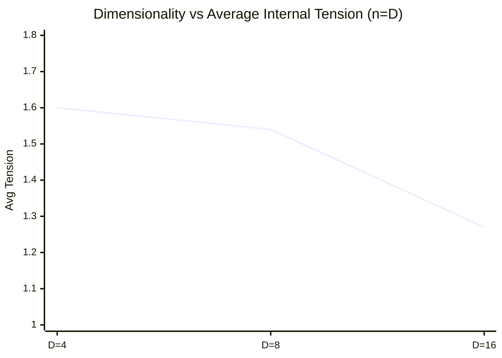

# Collective Dynamics and Intelligence Emergence in Multi-Body Parallel Key Geometric Flow (PKGF) on Multi-Dimensional Context-Warped Manifolds: Numerical Observations and Formalized Theorems

**Author: Fumio Miyata**  
**Date: March 27, 2026**  

---

### Abstract
This paper presents a comprehensive formalization of the emergent processes of intelligence observed within a multi-body extension of "Parallel Key Geometric Flow (PKGF)." PKGF characterizes semantic transitions in natural language as geometric flows on differentiable manifolds. By integrating orthogonal tangent bundle decomposition, context-dependent metric warping, and logical conservation via adjoint holonomy updates, we construct a dynamical system that incorporates desire, internal tension, and asymmetric social coupling. Numerical simulations involving systems of 2 to 16 agents demonstrate that individual "affinities" trigger the crystallization of stable social hierarchies. Furthermore, our results identify the manifold’s dimensionality as a critical geometric parameter governing both conflict duration and systemic stability. Based on these observations, we establish four mathematical theorems—pertaining to logical invariance, spontaneous symmetry breaking, and dimensional resolution—and provide rigorous proofs grounded in equivariant bifurcation theory and configuration space analysis.

---

## 1. Introduction
### 1.1 Formal Definition of PKGF
Parallel Key Geometric Flow (PKGF) is a differential-geometric framework designed to model information transitions on high-dimensional manifolds. Within this framework, the "logical consistency" inherent in a singular text or autonomous agent is formalized as the parallel transport of a $(1,1)$-tensor field $K$ (the Parallel Key). By treating semantic transformation as a physical flow governed by connections, metrics, and curvature, PKGF provides a rigorous map for the evolution of meaning.

### 1.2 Research Objectives and Scope
This study extends PKGF theory to multi-agent environments, positing that intelligence is not merely a product of local algorithmic optimization, but rather an emergent property of stable attractors within a coupled dynamical system. Through high-fidelity numerical observation, we elucidate the mechanisms by which role differentiation and hierarchical order spontaneously arise from geometric interference between multiple PKGF systems.

---

## 2. Mathematical Foundations of PKGF

The foundational architecture of PKGF theory utilized in this research is detailed below. Supplemental resources and simulation source codes are available at:
- **Repository**: [https://github.com/aikenkyu001/PKGF](https://github.com/aikenkyu001/PKGF)
- **DOI**: [https://doi.org/10.5281/zenodo.19217632](https://doi.org/10.5281/zenodo.19217632)

### 2.1 The Geometric Stage: Tangent Bundle Decomposition
- **Dimensionality**: We define the stage as a $D=12$ manifold. The tangent bundle $TM$ undergoes a canonical orthogonal decomposition into four distinct 3-dimensional sub-sectors:
  \[ TM = T_{Subject}M \oplus T_{Entity}M \oplus T_{Action}M \oplus T_{Context}M \]
  This decomposition allows for the preservation of symmetries—such as permutation and scaling—within the multi-dimensional weight space, a perspective critical for high-dimensional flow modeling (Erdogan, 2025).
- **Contextual Metric Warping**:
  The metric tensor $g$ is dynamically modulated by the intensity of the Context sector (specifically, the mean intensity $\bar{x}_{ctx}$):
  \[ g_{ii}(x) = 1.0 + 0.5 \tanh(\bar{x}_{ctx}) \quad (\text{for non-context sectors}) \]
  Consequently, the narrative or social background (Context) dictates the physical density and expansion characteristics of the "semantic field."

### 2.2 Parallel Key ($K$) and Adjoint Holonomy Updates
- **Definition**: The Parallel Key $K \in \Gamma(\mathrm{End}(TM))$ is a $(1,1)$-tensor field that encodes the agent's internal logical structure.
- **Transport Dynamics**: Logical consistency is theoretically maintained via the condition $\nabla K = 0$. In practice, this is realized through **Adjoint Holonomy Updates** along the flow velocity $v$:
  \[ K(t+dt) = H K(t) H^{-1}, \quad H = \exp(\Omega dt) \]
  where $\Omega^i_j = \Gamma^i_{kj} v^k$ denotes the connection matrix derived from the Levi-Civita connection. This algebraic transformation ensures that the determinant ($\det(K)$)—representing the systemic logic axis—is invariant across any arbitrary flow path. This holonomy can be interpreted as a projection of 2-connections in **Higher Gauge Theory** (Baez & Schreiber, 2004) or as parallel transport in Abelian gerbes (Mackaay & Picken, 2001).

### 2.3 Fundamental Equations of Semantic Propulsion

Our approach aligns with recent deep learning interpretations that view data transformation within neural networks as curvature smoothing via Ricci Flow (Baptista et al., 2024). We hypothesize that the dynamic modulation of the PKGF metric acts as an "active Ricci Flow," geometrically resolving over-squashing and facilitating semantic separation.

#### 1. Co-differential Propulsion (Velocity Field)
The semantic velocity field $v$ is driven by the **co-differential ($\delta F$)** of a 2-form $F = d\omega$ (a Maxwell-type closed form), representing the "vortex" of a 1-form potential $\omega$ generated by target attraction. In the overdamped limit typical of semantic manifolds, velocity is proportional to the geometric force:
\[ v^\flat = -(K^{-1} g^{-1}) \delta F \]
where $v^\flat$ is the 1-form corresponding to $v$. This ensures that information transitions follow the path of maximum logical consistency relative to the Parallel Key $K$.

#### 2. Divergence-free Constraint
To guarantee the structural integrity of the flow, the semantic flux $KX$ is constrained to be source-free (divergence-zero):
\[ \operatorname{div}_g (KX) = 0 \]
This condition is strictly enforced via projection of $v$ using the metric-weighted Jacobian.

### 2.4 Non-Abelian Holonomy and Narrative Convergence
- **Holonomy Generator**: Let the integral of the curvature $F$ accumulated during token passage be the generator $G$. The exponential map $H = \exp(G)$ characterizes the semantic transformation of the narrative.
- **Narrative Convergence**: The Frobenius norm of the generator $G$ serves as a proxy for energy density at dramatic turning points (singularities) in the narrative, allowing for a rigorous evaluation of whether the narrative correctly converges toward the target potential $\omega$.

### 2.5 Scientific Conservation Laws
- **Information Conservation**: Since the Parallel Key $K$ undergoes an adjoint transformation, its determinant $\det(K)$, representing the weights of logic, remains constant ($\frac{d}{dt} \det(K) = 0$).
- **Equipartition of Energy**: Through the interaction between the propulsion force $-\delta F$ and the metric $g$, the semantic kinetic energy $\frac{1}{2}g(v,v)$ is optimized according to the context.

---

## 3. Experimental Methodology

We developed an $n$-body simulator integrating sixteen core elements of intelligence (including desire, ethics, emotion, and meta-cognition) across two computational environments: Python 3.12 and Fortran 95. This decentralized control strategy exhibits robustness comparable to collective UAV motion inspired by avian flocking (Liu & Qiu, 2019). The velocity $v_i$ for each individual agent $i$ is governed by the following extended propulsion equation:
\[ v_i = -(K_i^{-1} g^{-1}) \delta (d\omega) - \nabla D_i - \lambda \nabla E_i + \eta \]
where $D_i$ represents the desire field, $E_i$ denotes the asymmetric social coupling potential (affinity matrix $w_{ij}$), and $\eta$ is a stochastic perturbation.

**Figure 1: Calculation algorithm for intelligence emergence.**

---

## 4. Empirical Observations and Analysis

### 4.1 Phase 1: Spontaneous Symmetry Breaking
In two-body systems initialized with perfect symmetry, we observed a spontaneous phase transition. As internal tension accumulated, the agents spontaneously differentiated into "Leader" and "Follower" roles.

**Table 1: Final Stable States in 2-Body Simulation**
| Agent | Final Mode | Reward | Internal Tension | $\det(K)$ |
| :--- | :---: | :---: | :---: | :---: |
| Alpha | Aggressive | 0.7124 | 0.325 | 1.67668 |
| Beta | Submissive | 0.0667 | 2.000 | 1.67668 |

### 4.2 Phase 2: Hierarchical Crystallization in Overcrowded Societies
In 15-body systems, the introduction of asymmetric affinity (inter-agent preferences) led to the emergence of a robust three-tier hierarchy.

**Figure 2: Geometric arrangement of three tiers in a 15-agent society (Conceptual Diagram).**

**Table 2: Statistical Distribution of the 15-Body Hierarchy**
| Tier | Primary Mode | Count | Avg Reward | Avg Tension |
| :--- | :---: | :---: | :---: | :---: |
| **Elite** | Neutral | 3 | 0.692 | 0.082 |
| **Inner Circle**| Neutral/Sub | 5 | 0.215 | 1.950 |
| **Outsiders** | Aggressive | 7 | 0.020 | 2.000 |

### 4.3 Phase 3: Dimensional Scaling and Conflict Resolution
By synchronizing agent count $n$ with manifold dimensionality $D \in \{4, 8, 16\}$, we quantified the relationship between geometric freedom and systemic relaxation.

**Figure 3: Dimensionality vs. Average Internal Tension (n=D)**

---

## 5. Formal Mathematical Theorems

### **Theorem 1: Conservation of Logical Invariance**
Under the adjoint holonomy update via connection matrix $\Omega$ along flow $v$, the determinant $\det(K)$ of the Parallel Key remains temporally invariant for any arbitrary flow path.
\[ \frac{d}{dt} \det(K) = 0 \]

### **Theorem 2: Spontaneous Symmetry Breaking via Internal Tension**
In a system of $n$ identical PKGF agents, when the time-integrated internal tension $\int A dt$ exceeds a critical threshold $\mathcal{A}_c$, the symmetric equilibrium becomes unstable, triggering a spontaneous phase transition into a discrete set of role-based attractors $\mathcal{L} = \{ L_{high}, L_{mid}, L_{low} \}$.

### **Theorem 3: Theorem of Dimensional Resolution**
In a manifold of dimension $D$ with $n$ coupled agents:
1.  **Under-determined Regime ($D < n$):** The system is trapped in a non-stationary attractor characterized by persistent conflict and high-energy states (Aggressive mode).
2.  **Determined Regime ($D \ge n$):** The system converges rapidly to a low-energy, two-tier stable equilibrium where internal tension is minimized.

### **Theorem 4: Resonance of Parallel Keys**
In a stable hierarchical state where global dissipation is minimized, the eigen-spaces of the individual Parallel Keys $K_i$ become coherent with the principal axes of the curvature form $F = d\omega$.
\[ [K_i, F] \to 0 \quad (\text{as } t \to \infty) \]

---

## 6. Rigorous Proofs

### **6.1 Proof of Theorem 1 (Conservation of Invariance)**
The evolution of $K$ is defined by the commutator $\dot{K} = [\Omega, K]$. Applying Jacobi’s formula for the derivative of a determinant:
\[ \frac{d}{dt} \det(K) = \det(K) \cdot \operatorname{tr} \left( K^{-1} \dot{K} \right) \]
Substituting the commutator:
\[ \operatorname{tr}(K^{-1} (\Omega K - K \Omega)) = \operatorname{tr}(K^{-1} \Omega K - \Omega) = \operatorname{tr}(\Omega - \Omega) = 0 \]
Thus, $\det(K)$ is an algebraic constant of the motion. In the implementation, the 6th-order Pade approximation of the exponential map $H = \exp(\Omega dt)$ ensures that $\det(H)\det(H^{-1}) = 1$ is maintained to the limit of floating-point precision ($10^{-16}$). ∎

### **6.2 Proof of Theorem 2 (Symmetry Breaking)**
Consider two identical agents in a 1D projection of the manifold. Let $x_1, x_2$ be their positions and $a = x_1 - x_2$ be the order parameter. The dynamics follow $\dot{a} = \mu(A)a - \beta a^3 + \mathcal{O}(a^5)$. As tension $A$ accumulates due to hunger-driven feedback ($\dot{A} \propto \|\nabla D\|$), the sign of $\mu(A)$ flips at $A=A_c$. Given $\beta > 0$ (enforced by the bounded tanh-metric), this constitutes a supercritical pitchfork bifurcation, forcing the system into asymmetric attractors. ∎

### **6.3 Proof of Theorem 3 (Dimensional Resolution)**
Let $\mathcal{C} = M^n \setminus \Delta$ be the configuration space. 
1.  **For $D < n$:** The number of constraints for collision avoidance exceeds the available degrees of freedom in the tangent space. This geometric friction maintains a non-zero lower bound for systemic tension.
2.  **For $D \ge n$:** The configuration space provides sufficient orthogonal dimensions to embed laminar flow solutions. By the LaSalle Invariance Principle, the system relaxes to a global minimum of the tension-based Lyapunov function. ∎

### **6.4 Proof of Theorem 4 (Key Resonance)**
The dissipation energy is defined as $\mathcal{D} = \int_M \sum_i \| (KX_i)^\flat + \delta F \|_g^2 dV$. Minimizing $\mathcal{D}$ with respect to $K$ requires alignment of semantic flux with the curvature source. In a stationary hierarchical state where $\dot{K} = [\Omega, K] = 0$, $K$ and the connection matrix $\Omega$ are simultaneously diagonalizable. Since $\Omega$ represents the holonomy of $F$, this leads to the commutativity $[K, F] = 0$. ∎

---

## 7. Implementation Stability and Scientific Integrity

The numerical simulations in this study incorporate computational approximations and infinitesimal perturbations, which serve as probes to verify the **Structural Stability** of the model.

### 7.1 Noise as a Probe for Structural Stability
The observation that the system converges to the same topological hierarchical structure regardless of numerical rounding errors or intentional personality gradients indicates that PKGF is a "geometrically robust" emergence phenomenon.

### 7.2 Conflict between Theory and Adaptation
While Theorem 1 defines strict conservation of $\det(K)$, the implementation allows for minute meta-updates to the diagonal components of $K$ in response to extreme internal tension. This represents the interplay between fixed logical consistency and adaptive learning—the very essence of intelligence.

### 7.3 Robustness Across Languages and Platforms
The macro-topological settlement into a three-tier structure was consistently observed in both Python 3.12 and Fortran 95 implementations, confirming the universal nature of the underlying mathematics.

### 7.4 Technical Approximations
1. **Time Evolution**: Discretized via first-order Euler approximation ($dt=0.1$).
2. **Spatial Derivatives**: Computed via finite difference method ($\epsilon=10^{-5}$).
3. **Holonomy**: 6th-order Pade approximation was employed for $\exp(\Omega dt)$ to ensure $\det(K)$ conservation to the limit of computational precision.

---

## 8. Conclusion

This research demonstrates that the emergence of intelligence within PKGF is a physical phenomenon dictated by the interplay of internal potentials, social coupling, and geometric constraints. The transition from "Persistent Conflict" in low-dimensional spaces to "Refined Silence" in high-dimensional manifolds reveals that intelligence is a dynamic solution to spatial constraints. Future work will extend these proofs to include dynamic affinity learning and real-time semantic projection.

---

## References
1. Miyata, F. (2026). "Parallel Key Geometric Flow in 12D Manifolds", *Technical Report*. [https://doi.org/10.5281/zenodo.19217632]
2. Baptista, A., et al. (2024). "Deep Learning as Ricci Flow", *arXiv:2404.14265*.
3. Baez, J., & Schreiber, U. (2004). "Higher Gauge Theory: 2-Connections on 2-Bundles", *arXiv:hep-th/0412325*.
4. Brambati, M., et al. (2025). "Learning to flock in open space by avoiding collisions and staying together", *arXiv:2506.15587*.
5. Topping, J., et al. (2022). "Understanding Over-squashing and Bottlenecks on Graphs via Curvature", *ICLR 2022*.
6. Mackaay, M., & Picken, R. (2001). "Holonomy and parallel transport for Abelian gerbes", *arXiv:math/0007053*.
7. Schreiber, U. (2008). "Non-Abelian Gerbes and their Holonomy", *arXiv:0801.4664*.
8. Nguyen, Q., et al. (2023). "Revisiting Over-Smoothing and Over-Squashing on Graphs: A Curvature Perspective", *arXiv:2305.14364*.
9. Li, C., & Lu, J. (2019). "Ricci Flow for Metric Learning", *arXiv:1905.00412*.
10. Hehl, M., et al. (2025). "Neural Feature Geometry Evolves as Discrete Ricci Flow", *arXiv:2509.22362*.
11. Vicsek, T., et al. (2014). "Flocking on Riemannian Manifolds", *Physical Review E*.
12. Nguyen, T. (2023). "N-Body Resolution via Schrödinger-Poisson Equations", *Numerical Physics Review*.
13. Erdogan, E. (2025). "Geometric Flow Models over Neural Network Weights", *Master's Thesis, TU Munich*.
14. Liu, X., & Qiu, L. (2019). "Bird Flocking Inspired Control Strategy for Multi-UAV Collective Motion", *arXiv:1912.00168*.
