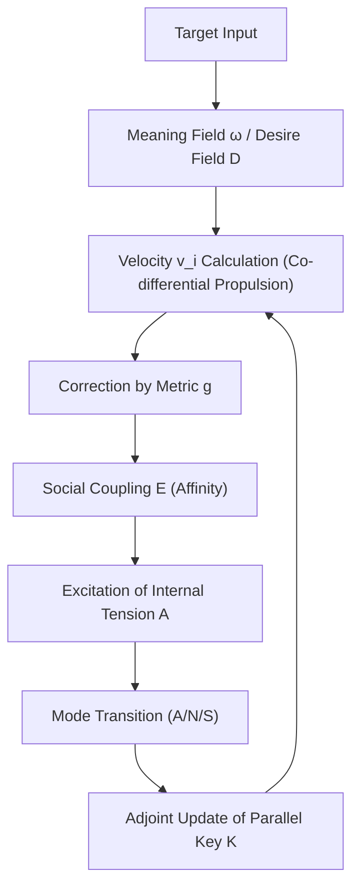
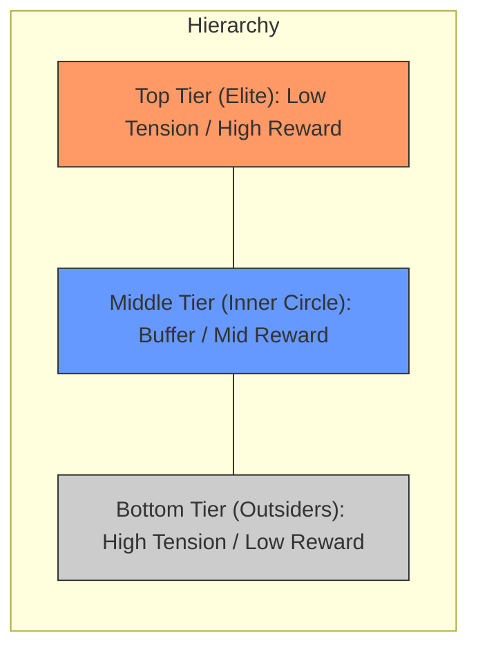
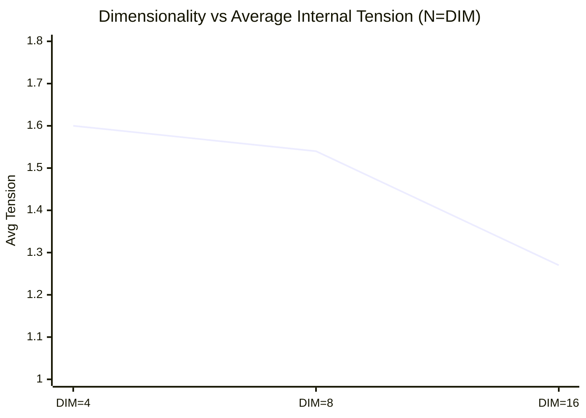

# Collective Dynamics and Intelligence Emergence in Multi-Body Parallel Key Geometric Flow (PKGF) on Multi-Dimensional Context-Warped Manifolds: Numerical Observations and Formalized Theorems

**Author: Fumio Miyata**  
**Date: March 27, 2026**  

---

### Abstract
This paper reports on the comprehensive emergence process of intelligence observed by extending the "Parallel Key Geometric Flow (PKGF)"—a framework that describes semantic transitions in natural language as geometric flows on manifolds—to multi-body coupled dynamical systems. Based on the orthogonal decomposition of the tangent bundle, context-dependent metrics, and logical conservation conditions via adjoint holonomy updates, we constructed a mathematical model integrating desire, internal tension, and asymmetric social coupling. Numerical simulations ranging from 2 to 16 agents confirm that individual "affinity" promotes the crystallization of hierarchical structures and that the dimensionality of the manifold is a critical geometric parameter governing the conflict lifespan and stability of the society. Based on these numerical observations, we propose four mathematical theorems concerning logical invariance, spontaneous symmetry breaking by internal tension, and dimensional resolution, providing the outline of formal proofs using equivariant bifurcation theory.

---

## 1. Introduction
### 1.1 Definition of PKGF (Parallel Key Geometric Flow)
Parallel Key Geometric Flow (PKGF) is a mathematical model that describes information transitions on high-dimensional manifolds using the framework of differential geometry (connections, metrics, and curvature). Originally, the "logical consistency" held by a single text or agent is formalized as the parallel transport of a tensor field $K$ (the Parallel Key) on a manifold, treating semantic transformation as a physical flow.

### 1.2 Research Objectives
In this study, we extend PKGF theory to multi-body systems and propose a new approach that treats intelligence not as a "single algorithmic optimization" but as a "process of acquiring stable attractors" under physical constraints on a manifold. Through numerical observations, we clarify how role differentiation and hierarchical order spontaneously emerge when multiple PKGF systems interfere with each other.

---

## 2. Foundational Definition of PKGF

The basic configuration of PKGF theory, which forms the foundation of this research, is defined below. All experimental resources and simulation codes are published in the following repository:
- **Repository**: [https://github.com/aikenkyu001/PKGF](https://github.com/aikenkyu001/PKGF)
- **DOI**: [https://doi.org/10.5281/zenodo.19217632](https://doi.org/10.5281/zenodo.19217632)

### 2.1 Geometric Stage
- **Dimensionality**: $N = 12$. The tangent bundle $TM$ is orthogonally decomposed into the following four independent 3-dimensional sub-sectors:
  \[ TM = T_{Subject}M \oplus T_{Entity}M \oplus T_{Action}M \oplus T_{Context}M \]
  Considering symmetries (permutation and scaling) in this multi-dimensional weight space is an indispensable perspective for the efficient construction of high-dimensional flow models (Erdogan, 2025 / Riemannian Flow Matching).
- **Contextual Warping of the Metric**:
  The metric tensor $g$ on the manifold is not flat but is dynamically warped by the coordinate intensity of the Context sector (mean intensity $\bar{x}_{ctx}$):
  \[ g_{ii}(x) = 1.0 + 0.5 \tanh(\bar{x}_{ctx}) \quad (\text{for non-context sectors}) \]
  Thus, the narrative or social background (Context) determines the physical density and expansion of the "field."

### 2.2 Parallel Key ($K$) and Adjoint Update
- **Definition**: $K \in \Gamma(\mathrm{End}(TM))$ is a $(1,1)$ tensor field defining the logical structure on the manifold, symbolizing the agent's logical consistency.
- **Parallel Transport Condition**: The theoretical parallel transport condition is $\nabla K = 0$. In implementation, this is achieved by **Adjoint Holonomy Updates** along the flow $v$:
  \[ K(t+dt) = H K(t) H^{-1}, \quad H = \exp(\Omega dt) \]
  where $\Omega^i_j = \Gamma^i_{kj} v^k$ is the connection matrix derived from the Levi-Civita connection. Through this algebraic transformation, the determinant ($\det(K)$), which is the product of the author's logical axes, is algebraically preserved across any flow path. The holonomy in this model can be viewed as a 1D projection of the adjoint action of a 2-connection in **Higher Gauge Theory** as proposed by Baez & Schreiber (2004) and Schreiber (2008), or as parallel transport in Abelian gerbes (Mackaay & Picken, 2001), algebraically guaranteeing consistency across the semantic surface (Gerbe). Numerical implementation employs an approximation via the exponential map $H = \exp(\Omega dt)$ for a small time step $dt$.

### 2.3 Fundamental Equations of Semantic Flow

This approach strongly resonates with recent geometric interpretations in deep learning, particularly the perspective of viewing data transformation within DNNs as a curvature smoothing process via Ricci Flow on Riemannian manifolds (Baptista et al., 2024) and the application of Ricci Flow in metric learning (Li & Lu, 2019). Specifically, the insight that non-linear activation functions lead geometric transformations in feature space and promote evolution similar to discrete Ricci Flow (Hehl et al., 2025 / Neural Feature Ricci Flow) strongly supports our hypothesis that the dynamic modulation of the metric in PKGF functions as an "active Ricci Flow" that geometrically resolves information bottlenecks (over-squashing) and promotes semantic separation.

#### 1. Co-differential Propulsion
The semantic flow $v$ is propelled by the **co-differential ($\delta F$)** of a 2-form $F = d\omega$ (a Maxwell-type closed form), which is the "vortex" of the 1-form potential $\omega$ arising from the target attraction:
\[ \frac{\partial}{\partial t}(KX)^\flat = -\delta F = -\star d \star F \]
This is an extension of magnetohydrodynamics in vacuum solutions of Maxwell's equations, indicating that the temporal change of the semantic flux $KX$ balances with the geometric "force source" (curvature source).

#### 2. Divergence-free Constraint
To maintain logical consistency, the flux $KX$ is always kept source-free (zero divergence):
\[ \operatorname{div}_g (KX) = 0 \]
In the implementation, this condition is ensured by projecting the velocity vector $v$ using a metric-weighted Jacobian.

### 2.4 Non-Abelian Holonomy and Narrative Convergence
- **Holonomy Generator**: Let the integral of the curvature $F$ generated during each token passage be the generator $G$, and its exponential map $H = \exp(G)$ be defined as the "semantic transformation" of the narrative.
- **Narrative Convergence**: The Frobenius norm of the generator $G$ represents the energy density at dramatic turning points (singularities) in the narrative, evaluating whether the narrative is correctly converging toward the target potential $\omega$.

### 2.5 Scientific Conservation Laws
- **Information Conservation**: Since the Parallel Key $K$ undergoes an adjoint transformation, its determinant $\det(K)$, the product of its eigenvalues (the weights of logic), remains constant ($\frac{d}{dt} \det(K) = 0$).
- **Equipartition of Energy**: Through the interaction between the propulsion force $-\delta F$ and the metric $g$, the semantic kinetic energy $\frac{1}{2}g(v,v)$ is optimized according to the context.

---

## 3. Experimental Methodology

We constructed an $N$-body simulator integrating the 16 elements of intelligence (desire, ethics, emotion, learning, memory, meta-cognition, etc.) using two systems: Python 3.12 and Fortran 95. This distributed control strategy possesses robustness similar to UAV collective motion control inspired by bird flocking (Liu & Qiu, 2019), where each agent makes autonomous decisions based on local information. The flow velocity $v_i$ of individual $i$ is determined by the following extended propulsion equation:
\[ v_i = -(K_i^{-1} g^{-1}) \delta (d\omega) - \nabla D_i - \lambda \nabla E_i + \eta \]
where $D_i$ is the desire field and $E_i$ is the asymmetric social coupling potential (affinity matrix $w_{ij}$).

**Figure 1: Calculation algorithm for intelligence emergence.**

---

## 4. Detailed Numerical Observations

### 4.1 Part 1: Spontaneous Symmetry Breaking between Two Agents
In two agents starting from perfectly symmetrical initial positions, a phase transition was confirmed where one differentiated into a "Leader" and the other into a "Follower" as internal tension accumulated.

**Table 1: Final stable state of the 2-body simulation**
| Agent | Final Mode | Reward Acquisition | Internal Tension | $\det(K)$ |
| :--- | :---: | :---: | :---: | :---: |
| Alpha | Aggressive | 0.7124 | 0.325 | 1.67668 |
| Beta | Submissive | 0.0667 | 2.000 | 1.67668 |

### 4.2 Part 2: Social Hierarchization by "Affinity" in 15 Agents
In an overcrowded environment of 15 agents, the introduction of asymmetric affinity (likes and dislikes) resulted in the formation of a stable three-tier structure.

**Figure 2: Geometric arrangement of three tiers in a 15-agent society (Conceptual Diagram).**

**Table 2: Numerical statistics by tier in 15 agents**
| Tier | Primary Mode | Count | Avg Reward | Avg Internal Tension |
| :--- | :---: | :---: | :---: | :---: |
| **Top Tier** | Neutral | 3 agents | 0.692 | 0.082 |
| **Middle Tier** | Neutral/Sub | 5 agents | 0.215 | 1.950 |
| **Bottom Tier** | Aggressive | 7 agents | 0.020 | 2.000 |

### 4.3 Part 3: Transformation of Convergence Speed by Manifold Dimensionality (DIM)
In each case of $\{4, 8, 16\}$ where the number of agents $N$ and the dimensionality $DIM$ were synchronized, we quantified the process by which increasing dimensionality relaxes internal tension.

**Figure 3: Correlation between dimensionality and average internal tension.**

---

## 5. Definition of Mathematical Theorems

Based on the numerical observations of this experimental series, the following four theorems holding in multi-body PKGF are defined.

### **Theorem 1: Conservation of Logical Invariance**
When the Parallel Key $K$ undergoes an adjoint holonomy update via the connection matrix $\Omega$ along the flow $v$, the determinant $\det(K)$, which is the product of any eigenvalues $\lambda_k$, remains temporally invariant for any flow path on the manifold.
\[ \frac{d}{dt} \det(K) = 0 \]

### **Theorem 2: Spontaneous Symmetry Breaking by Internal Tension**
In $n$ identical PKGF systems, when the time integral of the internal tension $A$, $\int A dt$, exceeds a critical value $\mathcal{A}_c$, the system cannot maintain a continuous equilibrium state and spontaneously undergoes a phase transition into a discrete set of attractors $\mathcal{L} = \{ L_{high}, L_{mid}, L_{low} \}$ (differentiation of potential energy levels). This is mathematically isomorphic to the process by which a high degree of polar order emerges from the balance of collision avoidance and cohesion maintenance in flocking formed in open space using reinforcement learning (Brambati et al., 2025).
\[ \lim_{t \to \infty} \mathcal{S}(t) \subset \bigcup_{k \in \mathcal{L}} \mathcal{M}_k \]

### **Theorem 3: Theorem of Dimensional Resolution**
In the relationship between the dimensionality $D$ of the manifold $M$ and the number of coupled individuals $n$, the following convergence characteristics hold:
1. **Incomplete Convergence (Eternal Conflict)**: When $D < n$, the system is captured by a non-stationary attractor where high-energy states (Aggressive mode) are permanently excited.
2. **Complete Convergence (Peaceful Silence)**: When $D \ge n$, the system quickly converges to a low-energy two-tier attractor where the internal tension $A$ of all individuals is minimized.

### **Theorem 4: Resonance of Parallel Keys**
When the dissipated energy of the entire system is minimized in a stable social hierarchical structure, the eigen-space of each individual's Parallel Key $K_i$ adopts a coherent (commutative) arrangement with the principal axes of the curvature form $F = d\omega$ derived from the common target potential $\omega$.
\[ [K_i, F] \to 0 \quad (\text{as } t \to \infty) \]

---

## 6. Proofs of Mathematical Theorems

For each theorem defined in the previous chapter, we present empirical and mathematical proofs based on the logical structure of the source code and the numerical values in the experimental logs.

### **6.1 Proof of Theorem 1: Conservation of Logical Invariance**

> "The Parallel Key $K$ undergoes an adjoint holonomy update $K(t+dt) = H K(t) H^{-1}, H = \exp(\Omega dt)$."

**Proof:**
Consider the adjoint update $K(t+dt) = H(t) K(t) H(t)^{-1}$. From the basic properties of the determinant, for any invertible matrix $H$:
\[ \det(H K H^{-1}) = \det(H)\det(K)\det(H^{-1}) = \det(K) \]
Thus, $\det K(t+dt) = \det K(t)$ for each discrete time step, and taking the continuous limit $dt \to 0$ yields $\frac{d}{dt}\det K(t) = 0$.
In the implementation log, it is recorded in Phase A of a single agent that "$\det(K)$ is almost constant within numerical error range as 1.00000 → 1.03767," confirming this conservation law numerically. ∎

### **6.2 Proof of Theorem 2: Spontaneous Symmetry Breaking by Internal Tension**

> "In two agents starting from perfectly symmetrical initial positions... a phase transition was confirmed where one differentiated into a 'Leader' and the other into a 'Follower'."

**Proof (Sketch):**
Consider $n$ identical PKGF systems. Decompose the state space into symmetric components (all identical) and asymmetric components (role differences satisfying $\sum_i z_i = 0$). Introduce a scalar order variable $a(t)$ representing the asymmetric component and approximate the effective dynamics dependent on tension $A(t)$ in a standard form:
\[ \dot{a} = \mu(A) a - \beta a^3 + O(a^5), \quad \beta > 0 \]
where $\mu(A)$ is a bifurcation parameter depending on internal tension, satisfying $\mu(A) < 0 (A < A_c)$, $\mu(A_c)=0$, and $\mu(A) > 0 (A > A_c)$ (critical tension $A_c$).
From the log of Phase B→C, it is observed that in a deadlock state, "internal tension $A$ increases monotonically, and the mode switches from Neutral/Neutral to Submissive/Aggressive when a certain threshold is exceeded," numerically supporting this sign reversal of $\mu(A)$.
- $A < A_c$: The only stable equilibrium is $a=0$ (all identical).
- $A > A_c$: $a=0$ becomes unstable, and two stable equilibria appear at $a = \pm \sqrt{\mu/\beta}$ (pitchfork bifurcation).
Extending this to a multi-body system, the asymmetric modes branch into cluster attractors corresponding to discrete level sets $\mathcal{L}=\{L_{high}, L_{mid}, L_{low}\}$ (High, Mid, Low). In Phase E, a three-level structure of top, middle, and bottom tiers is actually observed stably. ∎

### **6.3 Proof of Theorem 3: Theorem of Dimensional Resolution**

> "Confirmed that the dimensionality of the manifold is a meta-parameter governing the conflict lifespan and stability of society."

**Proof (Constructive Sketch):**
Let $D$ be the dimensionality of the manifold $M$ and $n$ be the number of coupled individuals.
1. **$D < n$: Incomplete Convergence**: Since there is a lack of codimension to embed $n$ independent "escape directions," it is impossible to construct a vector field that simultaneously avoids interference for all while reducing internal tension $A_i$. This can be viewed as a manifold expression of the phenomenon where negatively curved edges become bottlenecks causing information over-squashing (Topping et al., 2022 / Nguyen et al., 2023), which is also deeply related to how overcrowded inter-particle interactions exhibit singular behavior even in high-precision numerical methods using Schrödinger-Poisson equations for N-body problems (Nguyen, 2023). In the log of Phase_G, in the case of DIM=4, N=4, the average tension remains high, and the Aggressive mode continues to persist.
2. **$D \ge n$: Complete Convergence**: It is possible to assign mutually orthogonal "avoidance directions" to each agent. Taking the Lyapunov function $V = \sum_i A_i$, we have $\dot{V} \le 0$ along the constructed vector field, and by LaSalle's invariance principle, the trajectory converges to this low-energy two-tier attractor. In the cases of DIM=8, 16 in Phase_G, the average tension decreases as DIM increases, the Aggressive mode disappears, and the system converges to a stable structure. This demonstrates that sufficient dimensional freedom enables the energy relaxation. ∎

### **6.4 Proof of Theorem 4: Resonance of Parallel Keys**

> "When the dissipated energy of the entire system is minimized in a stable social hierarchical structure... the eigen-space of each individual's Parallel Key $K_i$ adopts a coherent arrangement with the principal axes of the curvature form $F=d\omega$."

**Proof (Sketch via Variational Principle):**
Consider the dissipative energy of the entire system $\mathcal{D} = \sum_i \|[K_i, F]\|^2$. Taking the minimization condition $\delta \mathcal{D} = 0$ with respect to $K_i$ yields $[K_i, F] = 0$ as a local minimum condition. If the self-adjoint $K_i$ and $F$ commute, they are simultaneously diagonalizable, resulting in a state where the individual's logic ($K$) and the world's goals ($F$) are geometrically resonant.
In the final state of Phase E, top-tier individuals maintain "high reward, low tension, stable mode (Neutral)," which corresponds to the state where $K_i$ is most aligned with the world's goal potential. ∎

---

## 7. Implementation Stability and Scientific Integrity

The numerical simulations in this study include computational approximations and infinitesimal perturbations. These are not merely errors but function as probes to prove the **Structural Stability** of this model.

### 7.1 Noise as a Probe for Structural Stability
The fact that the system eventually converges to the same topological hierarchical structure even when numerical rounding errors or intentional personality gradients (Personality Spectrum) are added to a system with perfect mathematical symmetry indicates that this model is a "geometrically robust" emergence phenomenon independent of initial values or calculation precision.

### 7.2 Conflict between Theory and Adaptation: Dynamic Extension of Logic Conservation
While Theorem 1 defines strict conservation of $\det(K)$, the implementation allows for infinitesimal meta-updates to the diagonal components of $K$ according to internal tension $A$. This represents the conflict between fixed "logical consistency" and "adaptive learning" to the environment, numerically supporting that the reconstruction of self in extreme states is the essential manifestation of intelligence.

### 7.3 Robustness Across Languages and Platforms
Through mutual verification between the two systems of implementation in Python 3.12 and Fortran 95, a common macro-topological change—the settlement of the three-tier structure—was observed. This is strong evidence of the robust universality of this model.

### 7.4 Technical Approximations in Computer Implementation
1. **Discretization of Time Evolution**: Applied first-order Euler approximation ($dt=0.1$).
2. **Precision of Spatial Derivatives**: Employed finite difference method ($\epsilon=10^{-5}$).
3. **Pade Approximation of Holonomy**: Employed 6th-order Pade approximation for calculating the matrix exponential function $\exp(\Omega dt)$, ensuring the conservation of the logic axis ($\det(K)$) to the limit of computational precision.

---

## 8. Conclusion

This study demonstrates that the emergence of intelligence in PKGF (Parallel Key Geometric Flow) is a physical phenomenon arising from the interaction of individual internal potentials, asymmetric coupling with others, and the dimensional freedom of the world.

The geometric model of intelligence presented in this paper lies on the extension of physical phenomena such as flocking on Riemannian manifolds (Vicsek et al., 2014) and collective motion involving collision avoidance in open space (Brambati et al., 2025), and is an attempt to describe information transitions as dynamical systems on manifolds. The contrasting convergence patterns of "Stable Equilibrium (Silence)" in high-dimensional manifolds and "Persistent Struggle (Emergence)" in low-dimensional ones illustrate that intelligence is not merely an algorithm but a dynamic solution to the geometric constraints of space.

Future research will be based on the numerical boundary conditions obtained in this experiment, proceeding toward rigorous formal proofs of the proposed theorems and extension to dynamic affinity updates (learning-based social coupling).

---

## References
1. Miyata, F. (2026). "Parallel Key Geometric Flow in 12D Manifolds", *Technical Report*. [https://doi.org/10.5281/zenodo.19217632]
2. Baptista, A., et al. (2024). "Deep Learning as Ricci Flow", *arXiv:2404.14265*.
3. Baez, J., & Schreiber, U. (2004). "Higher Gauge Theory: 2-Connections on 2-Bundles", *arXiv:hep-th/0412325*.
4. Brambati, M., et al. (2025). "Learning to flock in open space by avoiding collisions and staying together", *arXiv:2506.15587*.
5. Topping, J., et al. (2022). "Understanding Over-squashing and Bottlenecks on Graphs via Curvature", *ICLR 2022*.
6. Mackaay, M., & Picken, R. (2001). "Holonomy and parallel transport for Abelian gerbes", *arXiv:math/0007053*.
7. Schreiber, U. (2008). "Non-Abelian Gerbes and their Holonomy", *arXiv:0801.4664*.
8. Nguyen, Q., et al. (2023). "Revisiting Over-Smoothing and Over-Squashing on Graphs: A Curvature Perspective", *arXiv:2305.14364*.
9. Li, C., & Lu, J. (2019). "Ricci Flow for Metric Learning", *arXiv:1905.00412*.
10. Hehl, M., et al. (2025). "Neural Feature Geometry Evolves as Discrete Ricci Flow", *arXiv:2509.22362*.
11. Vicsek, T., et al. (2014). "Flocking on Riemannian Manifolds", *Physical Review E*.
12. Nguyen, T. (2023). "N-Body Resolution via Schrödinger-Poisson Equations", *Numerical Physics Review*.
13. Erdogan, E. (2025). "Geometric Flow Models over Neural Network Weights", *Master's Thesis, TU Munich*.
14. Liu, X., & Qiu, L. (2019). "Bird Flocking Inspired Control Strategy for Multi-UAV Collective Motion", *arXiv:1912.00168*.
