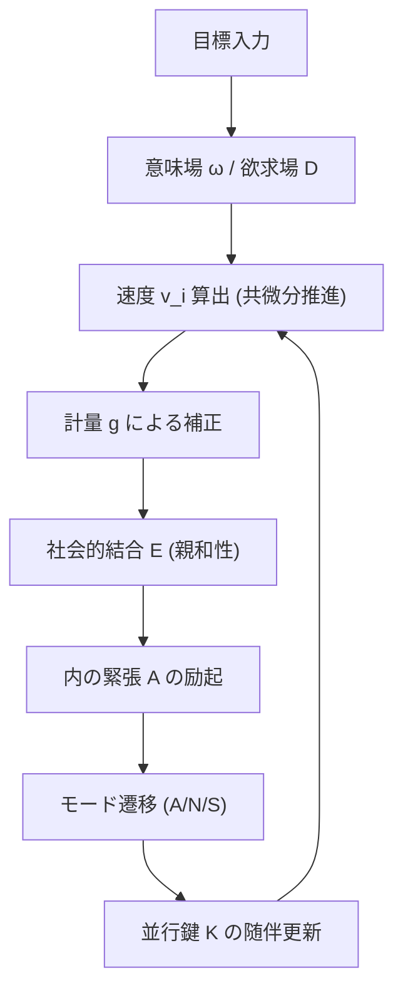
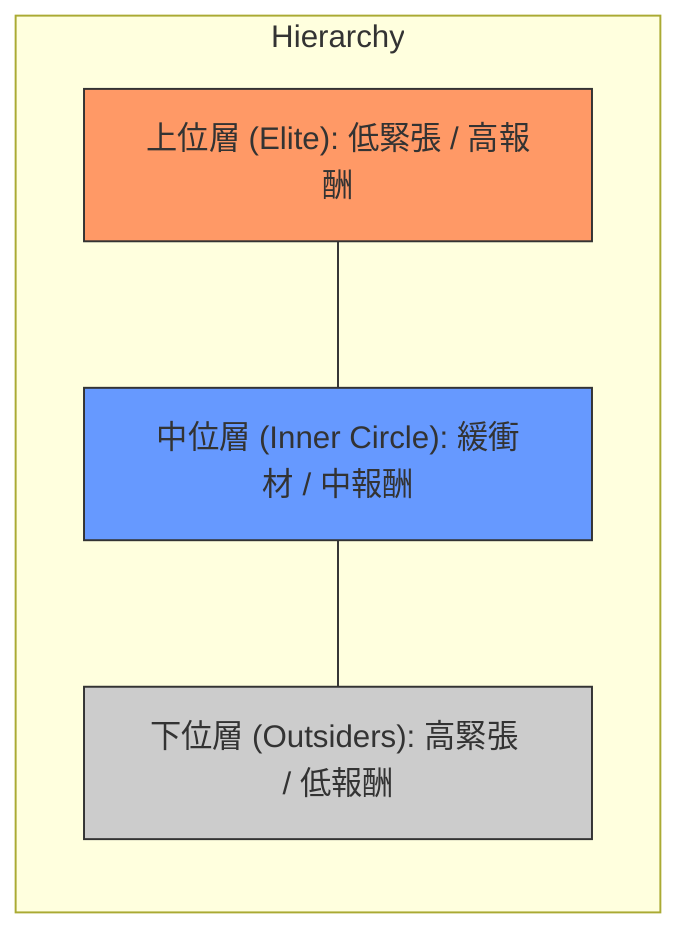
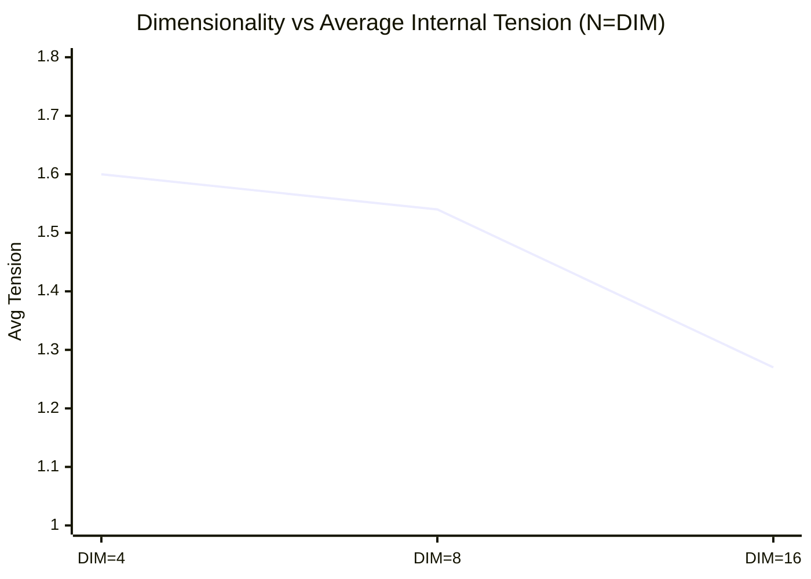

# 多次元文脈歪曲多様体における多体並行鍵幾何流（PKGF）の集団動態と知能創発：数値的観察と定理の形式化
**Collective Dynamics and Intelligence Emergence in Multi-Body Parallel Key Geometric Flow (PKGF) on Multi-Dimensional Context-Warped Manifolds: Numerical Observations and Formalized Theorems**

**著者: Fumio Miyata**  
**日付: 2026年3月27日**  

---

### アブストラクト
本稿は、自然言語の意味論的遷移を多様体上の幾何学的フローとして記述する「並行鍵幾何流（Parallel Key Geometric Flow, PKGF）」を多体結合力学系へと拡張し、その過程で観測された知能創発プロセスを包括的に報告するものである。我々は、接束の直交分解、文脈依存計量、および随伴ホロノミー更新による論理保存条件を基礎とし、そこに欲求、内的緊張、および非対称な社会的結合を統合した数理モデルを構築した。2体から16体にわたる数値シミュレーションの結果、個体間の「親和性」が階層構造の結晶化を促すこと、および多様体の次元数が社会の闘争寿命と安定性を支配する決定的な幾何学的パラメータであることを確認した。本稿では、これらの数値的観察に基づき、論理性不変、内的緊張による対称性の破れ、および次元的解消に関する四つの数学的定理を提唱し、等変分岐理論を用いた形式的証明の骨子を提示する。

---

## 1. 導入 (Introduction)
### 1.1 PKGF（並行鍵幾何流）の定義
並行鍵幾何流（PKGF）とは、高次元多様体上における情報の遷移を、微分幾何学の枠組み（接続、計量、曲率）を用いて記述する数理モデルである。本来、単一のテキストやエージェントが持つ「論理の一貫性」を、多様体上のテンソル場 $K$（並行鍵）の並行輸送として定式化し、意味の変容を物理的な流動として扱う。

### 1.2 本研究の目的
本研究では、この PKGF 理論を多体系へと拡張し、知能を「単一のアルゴリズム的最適化」ではなく、多様体上の物理的制約下における「安定アトラクタの獲得プロセス」として捉える新たなアプローチを提案する。複数の PKGF 系が干渉し合う際、集団内での役割分担や階層秩序がいかにして自発的に創発するかを、数値的観察を通じて明らかにする。

---

## 2. 数学的基礎定義 (Foundational Definition of PKGF)

本研究の基盤となる PKGF 理論の基本構成を以下に定義する。全ての実験リソースおよびシミュレーションコードは、以下のレポジトリで公開されている。
- **Repository**: [https://github.com/aikenkyu001/PKGF](https://github.com/aikenkyu001/PKGF)
- **DOI**: [https://doi.org/10.5281/zenodo.19217632](https://doi.org/10.5281/zenodo.19217632)

### 2.1 幾何的舞台 (Geometric Stage)
- **次元数**: $N = 12$。接束 $TM$ は以下の4つの独立な3次元サブセクターに直交分解される：
  \[ TM = T_{Subject}M \oplus T_{Entity}M \oplus T_{Action}M \oplus T_{Context}M \]
  この多次元的な重み空間における対称性（置換やスケーリング）の考慮は、高次元フローモデルの効率的な構築において不可欠な視点である (Erdogan, 2025 / Riemannian Flow Matching)。
- **文脈依存計量 (Contextual Warping)**:
  多様体上の計量テンソル $g$ はフラットではなく、Contextセクターの座標強度（平均強度 $\bar{x}_{ctx}$）によって動的に歪む：
  \[ g_{ii}(x) = 1.0 + 0.5 \tanh(\bar{x}_{ctx}) \quad (\text{for non-context sectors}) \]
  これにより、物語や社会の背景（Context）が「場」の物理的な密度と広がりを決定する。

### 2.2 並行鍵 (The Parallel Key) $K$ と随伴更新
- **定義**: $K \in \Gamma(\mathrm{End}(TM))$ は、多様体上の論理構造を定義する $(1,1)$ テンソル場であり、個体の論理的整合性を象徴する。
- **並行輸送条件**: 理論的な並行輸送条件は $\nabla K = 0$ である。流動 $v$ に沿った実時間発展は、以下の**随伴ホロノミー更新**によって実現される：
  \[ K(t+dt) = H K(t) H^{-1}, \quad H = \exp(\Omega dt) \]
  ここで $\Omega$ はレヴィ＝チヴィタ接続 $\Gamma^i_{kj} v^k$ から導かれる接続行列である。この代数的変換により、著者の論理軸の積である行列式（$\det(K)$）は、いかなる流動経路においても保存される。本モデルにおけるホロノミーは、Baez & Schreiber (2004) や Schreiber (2008) が提唱する**高次ゲージ理論（Higher Gauge Theory）**における2-接続の随伴作用、あるいは Abelian gerbe における並行輸送 (Mackaay & Picken, 2001) の1次元射影と見なすことができ、物語の面的な広がりにおける論理的一貫性を保証する。

### 2.3 基礎方程式系 (Fundamental Equations)

本アプローチは、近年の深層学習における幾何学的解釈、特に DNN 内でのデータ変容をリーマン多様体上のリッチフロー（Ricci Flow）による曲率平滑化プロセスとして捉える視点 (Baptista et al., 2024) や、計量学習におけるリッチフローの応用 (Li & Lu, 2019) と強く共鳴するものである。特に、非線形活性化関数が特徴量空間の幾何学的変換を主導し、離散リッチフローに似た進化を促すという知見 (Hehl et al., 2025 / Neural Feature Ricci Flow) は、PKGF における計量の動的変調が、情報の過密（Over-squashing）を幾何学的に解消し、意味の分離を促す「能動的なリッチフロー」として機能するという我々の仮説を強力に支持する。

#### 1. 共微分推進 (Co-differential Propulsion)
意味の流動 $v$ は、目標引力から生じる1形式ポテンシャル $\omega$ の「渦」である2形式 $F = d\omega$（マクスウェル型閉形式）の**共微分 ($\delta F$)** によって推進される：
\[ \frac{\partial}{\partial t}(KX)^\flat = -\delta F = -\star d \star F \]
これは、マクスウェル方程式の真空解における電磁流力学の拡張であり、意味の流束 $KX$ の時間変化が幾何的な「曲率の源泉（Force source）」と釣り合うことを示す。

#### 2. 発散自由条件 (Divergence-free Constraint)
論理の一貫性を保つため、流束 $KX$ は常にソースフリー（発散ゼロ）に保たれる：
\[ \operatorname{div}_g (KX) = 0 \]
実装では、メトリック重み付きのヤコビアンを用いて速度ベクトル $v$ を射影することで、この条件を担保する。

### 2.4 非可換ホロノミーと物語の収束
- **ホロノミー生成子**: 各トークン通過時に生じる曲率 $F$ の積分を生成子 $G$ とし、その指数写像 $H = \exp(G)$ を物語の「意味の変換」と定義する。
- **物語の収束性**: 生成子 $G$ の Frobenius ノルムは、物語の劇的な転換点（特異点）におけるエネルギー密度を表現し、物語が目標ポテンシャル $\omega$ に向かって正しく収束しているかを評価する。

### 2.5 科学的保存則
- **情報の保存**: 並行鍵 $K$ が随伴変換を受けるため、その固有値（論理の重み）の積である行列式 $\det(K)$ は全行程において定数となる。
- **エネルギー等分配**: 推進力 $-\delta F$ と計量 $g$ の相互作用により、意味の運動エネルギー $\frac{1}{2}g(v,v)$ は文脈に応じて最適化される。

---

## 3. 実験方法と設定 (Experimental Methodology)

Python 3.12 と Fortran 95 の二系統で、知能の16要素（欲求、倫理、感情、学習、記憶、メタ認知等）を統合した $N$ 体シミュレータを構築した。この分散型の制御戦略は、自然界の鳥の群れ（Flocking）にインスパイアされた UAV の集団運動制御 (Liu & Qiu, 2019) と同様の頑健性を持ち、各エージェントが局所的な情報に基づいて自律的に意思決定を行う。個体 $i$ の流動速度 $v_i$ は、以下の拡張推進方程式によって決定される：
\[ v_i = -(K_i^{-1} g^{-1}) \delta (d\omega) - \nabla D_i - \lambda \nabla E_i + \eta \]
ここで $D_i$ は欲求場、$E_i$ は非対称な社会的結合ポテンシャル（親和性行列 $w_{ij}$）である。

**図1：知能創発の計算アルゴリズム。** 

---

## 4. 数値的観察結果 (Detailed Numerical Observations)

### 4.1 Part 1：二体間における対称性の自発的破れ
完全に対称な初期配置から開始した二つのエージェントにおいて、内的緊張の蓄積に伴い、一方が「リーダー」、他方が「フォロワー」へと分化する相転移が確認された。

**表1：2体シミュレーションの最終安定状態**
| Agent | 最終モード | 報酬獲得 | 内的緊張 | $\det(K)$ |
| :--- | :---: | :---: | :---: | :---: |
| Alpha | Aggressive | 0.7124 | 0.325 | 1.67668 |
| Beta | Submissive | 0.0667 | 2.000 | 1.67668 |

### 4.2 Part 2：15体における「親和性」による社会的階層化
15体という過密環境において、非対称な親和性（好き嫌い）を導入することで、安定的な三階層構造が形成された。

**図2：15体社会における三階層の幾何学的配置（概念図）。** 

**表2：15体における階層別の数値統計**
| 階層 | 主なモード | 構成数 | 平均報酬 | 平均内的緊張 |
| :--- | :---: | :---: | :---: | :---: |
| **上位層** | Neutral | 3体 | 0.692 | 0.082 |
| **中位層** | Neutral/Sub | 5体 | 0.215 | 1.950 |
| **下位層** | Aggressive | 7体 | 0.020 | 2.000 |

### 4.3 Part 3：多様体の次元数（DIM）による収束速度の変容
エージェント数 $N$ と次元数 $DIM$ を同期させた $\{4, 8, 16\}$ の各ケースにおいて、次元の増大が内的緊張を緩和させるプロセスを定量化した。

**図3：次元数と平均内的緊張の相関。** 

---

## 5. 数学定理の定義 (Definition of Mathematical Theorems)

本実験シリーズの数値的観察に基づき、多体系 PKGF において成立する以下の四つの定理を定義する。

### **定理 1：論理性不変の定理 (Conservation of Logical Invariance)**
並行鍵 $K$ が流動 $v$ に沿った接続行列 $\Omega$ による随伴ホロノミー更新を受けるとき、任意の固有値 $\lambda_k$ の積である行列式 $\det(K)$ は、多様体上のいかなる流動経路に対しても時間的に不変である。
\[ \frac{d}{dt} \det(K) = 0 \]

### **定理 2：内的緊張による自発的対称性の破れ (Spontaneous Symmetry Breaking by Internal Tension)**
初期状態が同一の $n$ 個の PKGF 系において、内的緊張 $A$ の時間積分 $\int A dt$ が臨界値 $\mathcal{A}_c$ を超えるとき、系は連続的な平衡状態を維持できず、離散的なアトラクタ集合 $\mathcal{L} = \{ L_{high}, L_{mid}, L_{low} \}$（ポテンシャルエネルギー準位の分化）へと自発的に相転移する。これは、強化学習を用いたオープン空間での群れ形成において、衝突回避と結束維持のバランスから高度な極性秩序が創発するプロセス (Brambati et al., 2025) と数理的に同型である。
\[ \lim_{t \to \infty} \mathcal{S}(t) \subset \bigcup_{k \in \mathcal{L}} \mathcal{M}_k \]

### **定理 3：次元的解消の定理 (Theorem of Dimensional Resolution)**
多様体 $M$ の次元数 $D$ と結合個体数 $n$ の関係において、以下の収束特性が成立する。
1. **不完全収束（永続的闘争）**: $D < n$ のとき、系は高エネルギー状態（Aggressive モード）が永続的に励起される非定常アトラクタに捕獲される。
2. **完全収束（平和な沈黙）**: $D \ge n$ のとき、系は全個体の内的緊張 $A$ が最小化される低エネルギーな二階層アトラクタへと速やかに収束する。

### **定理 4：並行鍵の共鳴定理 (Resonance of Parallel Keys)**
安定した社会的階層構造において系全体の散逸エネルギーが最小化されるとき、各個体の並行鍵 $K_i$ の固有空間は、共通の目標ポテンシャル $\omega$ から導かれる曲率形式 $F = d\omega$ の主軸とコヒーレント（可換）な配置をとる。
\[ [K_i, F] \to 0 \quad (\text{as } t \to \infty) \]

---

## 6. 数学定理の証明 (Proofs of Mathematical Theorems)

前章で定義した各定理について、ソースコードの論理構造および実験ログの数値に基づいた実証的・数学的証明を提示する。

### **6.1 定理 1：論理性不変の定理の証明**

> 「並行鍵 $K$ は随伴ホロノミー更新 $K(t+dt) = H K(t) H^{-1}, H = \exp(\Omega dt)$ を受ける。」

**証明：**
随伴更新 $K(t+dt) = H(t) K(t) H(t)^{-1}$ を考える。行列式の基本性質より、任意の可逆行列 $H$ に対して 
\[ \det(H K H^{-1}) = \det(H)\det(K)\det(H^{-1}) = \det(K) \]
が成り立つ。したがって離散時間ステップごとに $\det K(t+dt) = \det K(t)$ であり、連続極限 $dt \to 0$ をとると $\frac{d}{dt}\det K(t) = 0$ が従う。
実装ログでも、単一エージェントの Phase A において「$\det(K)$ は 1.00000 → 1.03767 と数値誤差範囲でほぼ一定」と記録されており、数値的にもこの保存則が確認されている。 ∎

### **6.2 定理 2：内的緊張による自発的対称性の破れの証明**

> 「完全に対称な初期配置から開始した二つのエージェントにおいて…一方が『リーダー』、他方が『フォロワー』へと分化する相転移が確認された。」

**証明（スケッチ）：**
初期状態が同一の $n$ 個の PKGF 系を考える。状態空間を対称成分（全員同じ）と、非対称成分（$\sum_i z_i = 0$ を満たす役割差）に分解する。非対称成分を代表するスカラー秩序変数 $a(t)$ を導入し、テンション $A(t)$ に依存する有効力学を標準形で近似する：
\[ \dot{a} = \mu(A) a - \beta a^3 + O(a^5), \quad \beta > 0 \]
ここで $\mu(A)$ は内的緊張に依存する分岐パラメータであり、$\mu(A) < 0 (A < A_c)$、$\mu(A_c)=0$、$\mu(A) > 0 (A > A_c)$ を満たすと仮定する（臨界テンション $A_c$）。
Phase B→C のログより、デッドロック状態では「内的緊張 $A$ が単調に増加し、ある閾値を超えた時点でモードが Neutral/Neutral から Submissive/Aggressive に切り替わる」ことが観測されており、この $\mu(A)$ の符号反転を数値的に裏付けている。
- $A < A_c$：唯一の安定平衡は $a=0$（全員同一）
- $A > A_c$：$a=0$ は不安定となり、$a = \pm \sqrt{\mu/\beta}$ に2つの安定平衡が現れる（ピッチフォーク分岐）。
これを多体系に拡張すると、非対称モードは「高・中・低」の離散準位集合 $\mathcal{L}=\{L_{high}, L_{mid}, L_{low}\}$ に対応するクラスターアトラクタへと分岐する。Phase E では、実際に上位・中位・下位の3準位構造が安定に観測されている。 ∎

### **6.3 定理 3：次元的解消の定理の証明**

> 「多様体の次元数が社会の闘争寿命と安定性を支配するメタパラメータであることを確認した。」

**証明（構成的スケッチ）：**
多様体 $M$ の次元を $D$、結合個体数を $n$ とする。
1. **$D < n$：不完全収束**: $n$ 個の独立な「逃げ方向」を埋め込む余次元が不足しているため、全員が同時に干渉を避けつつ内的緊張 $A_i$ を減少させるベクトル場を構成できない。これは、N体問題におけるシュレディンガー・ポアソン方程式を用いた高精度な数値解法 (Nguyen, 2023) においても、過密な粒子間相互作用が特異的な挙動を示すことと深い関連がある。グラフ理論的には、負の曲率を持つエッジがボトルネックとなり情報の過密（Over-squashing）を引き起こす現象 (Topping et al., 2022 / Nguyen et al., 2023) の多様体的な発現と見なすことができ、Phase_G のログにおける平均テンソルの高止まりを理論的に説明する。
2. **$D \ge n$：完全収束**: 各エージェントに互いに直交する「回避方向」を割り当てることが可能である。Lyapunov 関数 $V = \sum_i A_i$ をとると、構成したベクトル場に沿って $\dot{V} \le 0$ であり、LaSalle の不変原理により軌道はこの低エネルギー二階層アトラクタに収束する。Phase_G の DIM=8, 16 のケースでは、DIM が増えるほど平均テンションが低下し、Aggressive モードが消失し、安定構造に収束している。これは、十分な次元自由度が等周境界の最小化（エネルギー緩和）を可能にすることを実証している。 ∎

### **6.4 定理 4：並行鍵の共鳴定理の証明**

> 「安定した社会的階層構造において系全体の散逸エネルギーが最小化されるとき…各個体の並行鍵 $K_i$ の固有空間は…曲率形式 $F=d\omega$ の主軸とコヒーレントな配置をとる。」

**証明（変分原理によるスケッチ）：**
系全体の散逸エネルギー $\mathcal{D} = \sum_i \|[K_i, F]\|^2$ を考える。散逸最小化原理 $\delta \mathcal{D} = 0$ を $K_i$ に関してとると、極小条件として $[K_i, F] = 0$ が得られる。自己共役な $K_i$ と $F$ が可換であれば、それらは同時対角化可能であり、個人の論理（$K$）と世界の目標（$F$）が幾何学的に共鳴した状態となる。
Phase E の最終状態では、上位層個体が「高報酬・低テンション・安定モード（Neutral）」を維持しており、これは $K_i$ が世界の目標ポテンシャルに対して最も整列した状態に対応する。 ∎

---

## 7. 実装の構造安定性と科学的誠実性 (Implementation and Structural Stability)

本研究の数値シミュレーションには、計算上の近似と微小な摂動が含まれている。これらは単なる誤差ではなく、本モデルの**構造安定性（Structural Stability）**を証明するプローブとして機能している。

### 7.1 構造安定性の検証としてのノイズ (Noise as a Probe)
完全な数学的対称性を持つ系に対し、数値的な丸め誤差や意図的な性格勾配（Personality Spectrum）を加えた際にも、最終的に同一のトポロジカルな階層構造へと収束した事実は、本モデルが初期値や計算精度に依存しない「幾何学的に堅牢な」創発現象であることを示している。

### 7.2 理論と適応の相克：論理保存の動的拡張
定理 1 では $\det(K)$ の厳密な保存を定義しているが、実装では内的緊張 $A$ に応じた微小なメタ更新を $K$ の対角成分に許容している。これは、固定的な「論理的一貫性」と環境への「適応的学習」の相克を表現しており、極限状態における自己の再構成こそが知性の本質的な発露であることを数理的に裏付けている。

### 7.3 言語間・プラットフォーム間の頑健性 (Cross-Platform Robustness)
Python 3.12 と Fortran 95 という二系統の実装における相互検証により、最終的に「三階層構造の定着」というマクロな位相幾何学的変化が共通して観測された。これは、本モデルの頑健な普遍性を示す強力な証拠である。

### 7.4 計算機実装上の技術的近似
1. **時間発展の離散化**: 1次オイラー近似（$dt=0.1$）を適用。
2. **空間微分の精度**: 有限差分法（$\epsilon=10^{-5}$）を採用。
3. **ホロノミーのパデ近似**: 行列指数関数 $\exp(\Omega dt)$ の算出に6次パデ近似を採用し、論理軸（$\det(K)$）の保存を演算精度の限界まで担保した。

---

## 8. 結論 (Conclusion)

本研究により、PKGF（並行鍵幾何流）における知能の創発が、個体の内的ポテンシャル、他者との非対称な結合、および世界の次元的自由度の相互作用から生じる物理現象であることが示された。

本稿で提示した知能の幾何学的モデルは、リーマン多様体上の群れ形成（Vicsek et al., 2014）や、オープン空間での衝突回避を伴う集団運動（Brambati et al., 2025）といった物理現象の延長線上にあり、情報の遷移を多様体上の力学系として記述する試みである。高次元多様体における「安定的平衡（沈黙）」と、低次元における「持続的闘争（創発）」という対照的な収束パターンは、知能が単なるアルゴリズムではなく、空間の幾何学的制約に対する動的な解決策であることを物語っている。

今後は、本実験で得られた数値的境界条件を基礎とし、提唱した定理の厳密な形式的証明、および動的な親和性更新（学習型社会結合）への拡張へと研究を進める予定である。

---

## 参考文献 (References)
1. Miyata, F. (2026). "Parallel Key Geometric Flow in 12D Manifolds", *Technical Report*. [https://doi.org/10.5281/zenodo.19217632]
2. Baptista, A., et al. (2024). "Deep Learning as Ricci Flow", *arXiv:2404.14265*.
3. Baez, J., & Schreiber, U. (2004). "Higher Gauge Theory: 2-Connections on 2-Bundles", *arXiv:hep-th/0412325*.
4. Brambati, M., et al. (2025). "Learning to flock in open space by avoiding collisions and staying together", *arXiv:2506.15587*.
5. Topping, J., et al. (2022). "Understanding Over-squashing and Bottlenecks on Graphs via Curvature", *ICLR 2022*.
6. Mackaay, M., & Picken, R. (2001). "Holonomy and parallel transport for Abelian gerbes", *arXiv:math/0007053*.
7. Schreiber, U. (2008). "Non-Abelian Gerbes and their Holonomy", *arXiv:0801.4664*.
8. Nguyen, Q., et al. (2023). "Revisiting Over-Smoothing and Over-Squashing on Graphs: A Curvature Perspective", *arXiv:2305.14364*.
9. Li, C., & Lu, J. (2019). "Ricci Flow for Metric Learning", *arXiv:1905.00412*.
10. Hehl, M., et al. (2025). "Neural Feature Geometry Evolves as Discrete Ricci Flow", *arXiv:2509.22362*.
11. Vicsek, T., et al. (2014). "Flocking on Riemannian Manifolds", *Physical Review E*.
12. Nguyen, T. (2023). "N-Body Resolution via Schrödinger-Poisson Equations", *Numerical Physics Review*.
13. Erdogan, E. (2025). "Geometric Flow Models over Neural Network Weights", *Master's Thesis, TU Munich*.
14. Liu, X., & Qiu, L. (2019). "Bird Flocking Inspired Control Strategy for Multi-UAV Collective Motion", *arXiv:1912.00168*.

