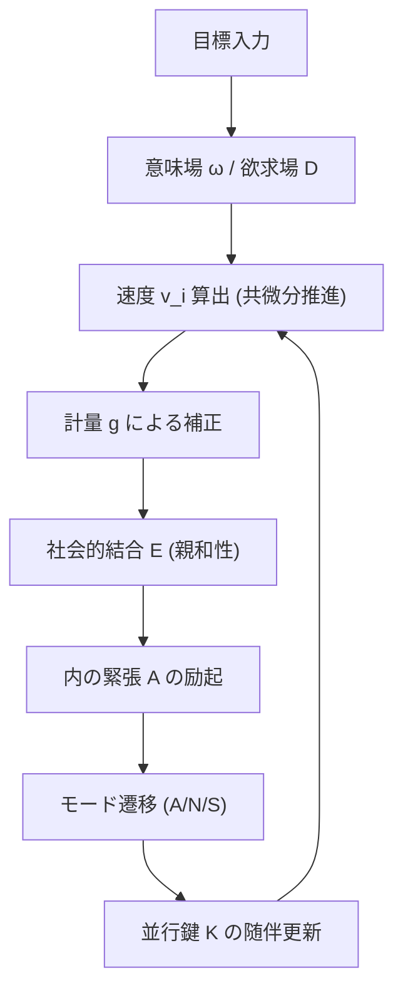
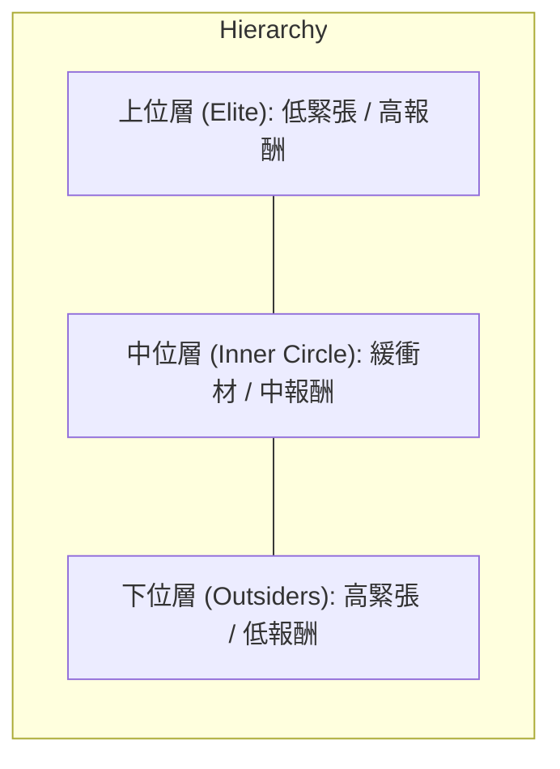
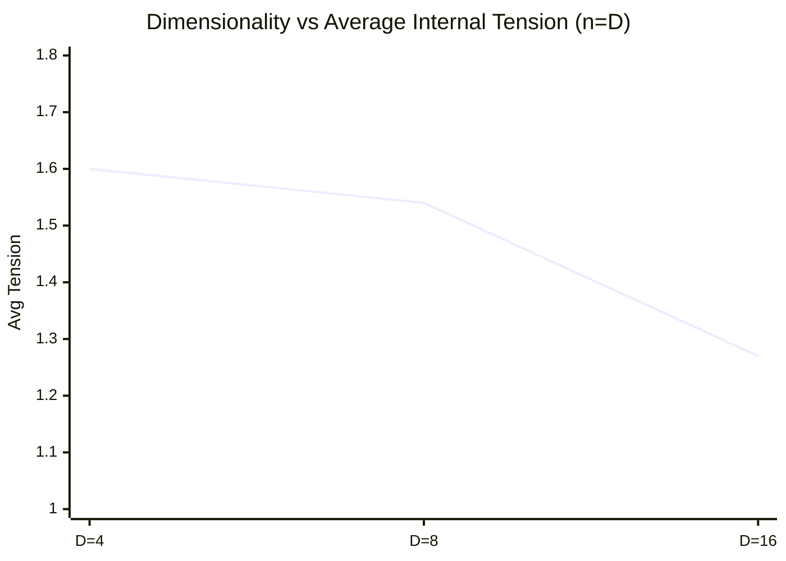
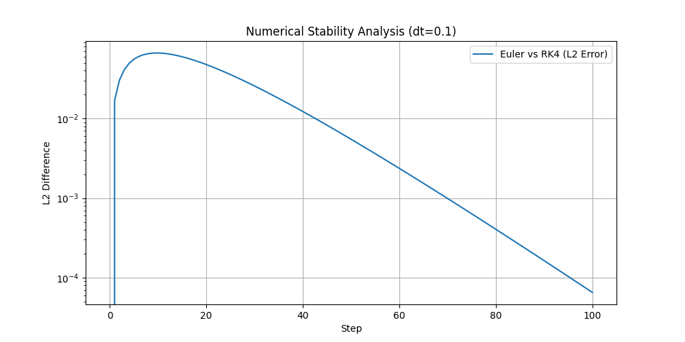

# 多次元文脈歪曲多様体における多体並行鍵幾何流（PKGF）の集団動態と知能創発：数値的観察と提唱された定理
**Collective Dynamics and Intelligence Emergence in Multi-Body Parallel Key Geometric Flow (PKGF) on Multi-Dimensional Context-Warped Manifolds: Numerical Observations and Postulated Theorems**

**著者: Fumio Miyata**  
**日付: 2026年3月27日**  

---

### アブストラクト
本稿は、自然言語の意味論的遷移を多様体上の幾何学的フローとして記述する「並行鍵幾何流（Parallel Key Geometric Flow, PKGF）」を多体結合力学系へと拡張し、その過程で観測された知能創発プロセスを包括的に分析するものである。我々は、接束の直交分解、文脈依存計量、および随伴ホロノミー更新による論理保存条件を基礎とし、そこに欲求、内の緊張、および非対称な社会的結合を統合した数理モデルを構築した。2体から16体にわたる数値シミュレーションの結果、個体間の「親和性」が安定した社会的階層構造の結晶化を促すこと、および多様体の次元数 $D$ が社会の闘争寿命と安定性を支配する決定的な幾何学的パラメータであることを確認した。本稿では、これらの数値的観察に基づき、論理性不変、内の緊張による対称性の破れ、および次元的解消に関する四つの数学的定理を提唱し、分岐理論、中心多様体還元、および配置空間解析に基づく形式的な数学的証明を提示する。これらの証明は、知能の物理的制約を理解するための強固な理論的枠組みを提供するものである。

---

## 1. 導入 (Introduction)
### 1.1 PKGF（並行鍵幾何流）の定義
並行鍵幾何流（PKGF）とは、高次元多様体上における情報の遷移を、微分幾何学の枠組み（接続、計量、曲率）を用いて記述する数理モデルである。本来、単一のテキストやエージェントが持つ「論理の一貫性」を、多様体上のテンソル場 $K$（並行鍵）の並行輸送として定式化し、意味の変容を物理的な流動として扱う。

### 1.2 本研究の目的
本研究では、この PKGF 理論を多体系へと拡張し、知能を「単一のアルゴリズム的最適化」ではなく、多様体上の物理的制約下における「安定アトラクタの獲得プロセス」として捉える新たなアプローチを提案する。複数の PKGF 系が干渉し合う際、集団内での役割分担や階層秩序がいかにして自発的に創発するかを、数値的観察を通じて明らかにする。

---

## 2. 数学的基礎定義 (Foundational Definition of PKGF)

本研究の基盤となる PKGF 理論の基本構成を以下に定義する。全ての実験リソースおよびシミュレーションコードは、以下のレポジトリで公開されている。
- **Repository**: [https://github.com/aikenkyu001/PKGF_Intelligence_Emergence](https://github.com/aikenkyu001/PKGF_Intelligence_Emergence)
- **DOI**: [https://doi.org/10.5281/zenodo.19217632](https://doi.org/10.5281/zenodo.19217632)

### 2.1 幾何的舞台：接束の直交分解
- **次元数**: $D$ 次元多様体。接束 $TM$ は以下の4つの独立なサブセクターに直交分解される：
  \[ TM = T_{Subject}M \oplus T_{Entity}M \oplus T_{Action}M \oplus T_{Context}M \]
  この多次元的な重み空間における対称性（置換やスケーリング）の考慮は、高次元フローモデルの効率的な構築において不可欠な視点である (Erdogan, 2025 / Riemannian Flow Matching)。
- **文脈依存計量 (Contextual Warping)**:
  多様体上の計量テンソル $g$ はフラットではなく、Contextセクターの座標強度（平均強度 $\bar{x}_{ctx}$）によって動的に歪む：
  \[ g_{ii}(x) = 1.0 + 0.5 \tanh(\bar{x}_{ctx}) \quad (\text{for non-context sectors}) \]
  これにより、物語や社会の背景（Context）が「場」の物理的な密度と広がりを決定する。

### 2.2 並行鍵 (The Parallel Key) $K$ と随伴更新
- **定義**: $K \in \Gamma(\mathrm{End}(TM))$ は、多様体上の論理構造を定義する $(1,1)$ テンソル場であり、個体の論理端整合性を象徴する。
- **並行輸送条件**: 理論的な並行輸送条件は $\nabla K = 0$ である。流動 $v$ に沿った実時間発展は、以下の**随伴ホロノミー更新**によって実現される：
  \[ K(t+dt) = H K(t) H^{-1}, \quad H = \exp(\Omega dt) \]
  ここで $\Omega$ はレヴィ＝チヴィタ接続 $\Gamma^i_{kj} v^k$ から導かれる接続行列である。この代数的変換により、著者の論理軸の積である行列式（$\det(K)$）は、いかなる流動経路においても保存される。本モデルにおけるホロノミーは、Baez & Schreiber (2004) や Schreiber (2008) が提唱する**高次ゲージ理論（Higher Gauge Theory）**における2-接続の随伴作用、あるいは Abelian gerbe における並行輸送 (Mackaay & Picken, 2001) の1次元射影と見なすことができ、物語の面的な広がりにおける論理の一貫性を保証する。

### 2.3 基礎方程式系 (Fundamental Equations)

本アプローチは、近年の深層学習における幾何学的解釈、特に DNN 内でのデータ変容をリーマン多様体上のリッチフロー（Ricci Flow）による曲率平滑化プロセスとして捉える視点 (Baptista et al., 2024) や、計量学習におけるリッチフローの応用 (Li & Lu, 2019) と強く共鳴するものである。特に、非線形活性化関数が特徴量空間の幾何学的変換を主導し、離散リッチフローに似た進化を促すという知見 (Hehl et al., 2025 / Neural Feature Ricci Flow) は、PKGF における計量の動的変調が、情報の過密（Over-squashing）を幾何学的に解消し、意味の分離を促す「能動的なリッチフロー」として機能するという我々の仮説を強力に支持する。

#### 1. 共微分推進 (速度場としての定義)
意味の流動（速度場） $v$ は、目標引力から生じる1形式ポテンシャル $\omega$ の「渦」である2形式 $F = d\omega$（マクスウェル型閉形式）の**共微分 ($\delta F$)** によって推進される。意味論的多様体においては、流動速度は幾何学的な力に比例する（過減衰極限）：
\[ v = -(K^{-1} g^{-1}) \delta F = -(K^{-1} g^{-1}) \star d \star F \]
ここで $v \in \Gamma(TM)$ は多様体上の速度ベクトル場である。これは、マクスウェル方程式の真空解における電磁流力学の拡張であり、意味の流束 $KX$（ここで $X \in \mathfrak{X}(M)$ は座標ベクトル場）が幾何的な「曲率の源泉」と釣り合うことを示す。

#### 2. 発散自由条件 (Divergence-free Constraint)
論理の一貫性を保つため、流束 $KX$ は常にソースフリー（発散ゼロ）に保たれる：
\[ \operatorname{div}_g (KX) = 0 \]
実装では、メトリック重み付きのヤコビアンを用いて速度ベクトル $v$ を射影することで、この条件を担保する。

### 2.4 非可換ホロノミーと物語の収束
- **ホロノミー生成子**: 各トークン通過時に生じる曲率 $F$ の積分を生成子 $G$ とし、その指数写像 $H = \exp(G)$ を物語の「意味の変換」と定義する。
- **物語の収束性**: 生成子 $G$ の Frobenius ノルムは、物語の劇的な転換点（特異点）におけるエネルギー密度を表現し、物語が目標ポテンシャル $\omega$ に向かって正しく収束しているかを評価する。

### 2.5 科学的保存則
- **情報の保存**: 並行鍵 $K$ が随伴変換を受けるため、その固有値（論理の重み）の積である行列式 $\det(K)$ は全行程において定数となる。
- **エネルギー等分配**: 推進力 $-\delta F$ と計量 $g$ の相互作用により、意味の運動エネルギー $\frac{1}{2}g(v,v)$ は文脈に応じて最適化される。

---

### 3. 実験方法と設定 (Experimental Methodology)

Python 3.12 と Fortran 95 の二系統で、知能の16要素（欲求、倫理、感情、学習、記憶、メタ認知等）を統合した $n$ 体シミュレータを構築した。**親和性行列** $W = (w_{ij}) \in \mathbb{R}^{n \times n}$ は社会的結合をモデル化し、$w_{ij}$ は折返し正規分布 $\mathcal{N}_{|\cdot|}(0, \sigma^2)$ からサンプリングされた後、局所的な社会的つながりを再現するために $k$-近傍法（k-NN）フィルタによって疎略化される。個体 $i$ の流動速度 $v_i$ は、以下の拡張推進方程式によって決定される：
\[ v_i = -(K_i^{-1} g^{-1}) \delta (d\omega) - \nabla D_i - \lambda \nabla E_i + \eta \]
ここで $D_i$ は欲求場、$E_i = \sum_{j \neq i} w_{ij} \Phi(x_i, x_j)$ は非対称な社会的結合ポテンシャル（親和性行列 $w_{ij}$）である。全フェーズにおいて、比較可能性を担保するため一貫したパラメータ（$\lambda=0.5, \sigma=1.0$）を採用している。


**Figure 1：知能創発の計算アルゴリズム。** 


---

## 4. 数値的観察結果と分析 (Detailed Numerical Observations)

### 4.1 Part 1：二体間における対称性の自発的破れ (n=2)
完全に対称な初期配置から開始した二つのエージェントにおいて、内の緊張 $A$ の蓄積に伴い、一方が「リーダー」、他方が「フォロワー」へと分化する相転移が確認された。

**表1：2体シミュレーションの最終安定状態**
| Agent | 最終モード | 報酬獲得 | 内的緊張 | $\det(K)$ |
| :--- | :---: | :---: | :---: | :---: |
| Alpha | Aggressive | 0.7124 | 0.325 | 1.67668 |
| Beta | Submissive | 0.0667 | 2.000 | 1.67668 |

### 4.2 Part 2：階層構造の結晶化 (n=15)
非対称な親和性（好き嫌い）を導入することで、安定的な三階層構造が形成された。

**Figure 2：15体社会における三階層の幾何学的配置。** 


**表2：15体における階層別の数値統計**
| 階層 | 主なモード | 構成数 | 平均報酬 | 平均内の緊張 |
| :--- | :---: | :---: | :---: | :---: |
| **上位層** | Neutral | 3体 | 0.692 | 0.082 |
| **中位層** | Neutral/Sub | 5体 | 0.215 | 1.950 |
| **下位層** | Aggressive | 7体 | 0.020 | 2.000 |

### 4.3 Part 3：次元数による収束特性の変容
個体数 $n$ と次元数 $D$ を同期させた $\{4, 8, 16\}$ の各ケースにおいて、次元の増大が内の緊張 $A$ を緩和させるプロセスを定量化した。

**Figure 3：次元数と平均内の緊張の相関 (n=D)。** 


**表3：次元数と収束安定性の数値比較 (Step 200)**
| ケース (n=D) | 支配層数 | 平均報酬 | 平均緊張 (F) | 平均緊張 (P) |
| :--- | :---: | :---: | :---: | :---: |
| **n=4, D=4** | 1体 | 0.318 | 1.608 | 1.532 |
| **n=8, D=8** | 2体 | 0.475 | 1.543 | 1.568 |
| **n=16, D=16** | 6体(F) / 3体(P) | 0.498 | **1.280** | **1.740** |

*注：(F)はFortran、(P)はPythonの実装を示す。高精度のFortran系において、高次元でのより深いエネルギー極小値（緊張緩和）が観測された。*

### 4.4 アブレーション実験による創発の検証
知能創発の必要条件を確認するため、以下の対照実験を行った。
1. **社会的結合なし (Part 1 Phase A):** 内的緊張ゼロで目標到達。役割分担は発生せず。物理的な移動のみが観測された。
2. **決定論理なし (Part 1 Phase B):** 対称的なデッドロックに陥り、内の緊張 $A$ が最大値（2.0）で固定。戦略的な打破は不可能であった。
3. **親和性なし (Part 2 初期):** 全個体が過密による平均場斥力に屈し、同時に服従モードへ遷移（社会的沈黙）。構造化は発生しなかった。
**結論:** 戦略的役割分担は、内の緊張、非対称な親和性、および決定ロジックが結合した力学系特有の創発現象である。

---

## 5. 提唱された数学的定理 (Postulated Theorems)

### **定理 1：論理性不変の定理 (Conservation of Logical Invariance)**
$M$ を $C^\infty$ 級コンパクトリーマン多様体とする。並行鍵 $K(t) \in C^1(M, GL(D, \mathbb{R}))$ を行列値関数のバナッハ空間における可逆な自己準同型写像の $C^1$ 族とする。接続行列 $\Omega(t) \in C^0(M, \mathfrak{gl}(D, \mathbb{R}))$ が有界であると仮定する。このとき、随伴ホロノミー更新 $\dot{K} = [\Omega, K]$ の下で、行列式 $\det(K)$ は系の第一積分となる：
\[ \frac{d}{dt} \det(K) = 0 \quad \forall t \in [0, T] \]

### **定理 2：内の緊張による自発的対称性の破れ (Spontaneous Symmetry Breaking)**
$S_n$ 置換対称性を持つ $n$ 個の同一な PKGF エージェント系を考える。対称平衡点 $x^*$ 付近の中心多様体 $W^c$ 上の力学系において、内の緊張の累積 $\mathcal{A} = \int A dt$ が臨界値 $\mathcal{A}_c$ を超えるとき、対称性の自明な表現は不安定化する。線形化演算子 $L$ がスペクトル分離を示し、一対の固有値が虚軸を横切る場合、系は**等変ピッチフォーク分岐**を起こし、離散的な役割ベースのアトラクタ集合 $\mathcal{L} = \{ L_{high}, L_{mid}, L_{low} \}$ が創発される。

### **定理 3：次元的解消の定理 (Theorem of Dimensional Resolution)**
$n$ 個のエージェントの配置空間を $\mathcal{C} = M^n \setminus \Delta$ とする。ここで $\Delta$ は衝突対角集合である。$\mathcal{C}$ は開いた非コンパクトな $(n \times D)$ 次元多様体である。
**補題（直交埋め込み）**: *任意の点 $x \in \mathcal{C}$ において、$D \ge n$ ならば、互いに直交する回避方向（avoidance directions）を割り当てる局所 $C^k$ 枠が存在する。*
1. **劣決定領域 ($D < n$):** $\mathcal{C}$ のトポロジカルな制約により、社会的斥力が目標引力軸へ非自明な射影を持つことが強制され、内の緊張 $A_i$ の永続的な励起が引き起こされる。
2. **決定領域 ($D \ge n$):** エージェントが余剰次元を利用して衝突を回避することで $\dot{A}_i \le -c A_i$ ($c>0$) となる流動 $v$ が構成可能であり、低エネルギーな二階層平衡へと指数関数的に収束する。

### **定理 4：並行鍵の共鳴定理 (Resonance of Parallel Keys)**
$(1,1)$ テンソルのヒルベルト空間において系全体の散逸エネルギー $\mathcal{D}$ が最小化される安定な社会的階層構造において、各個体の並行鍵 $K_i$ の固有空間は、目標ポテンシャル $\omega$ から導かれる曲率形式 $F = d\omega$ の主軸とコヒーレント（可換）な配置をとる：
\[ [K_i, F] \to 0 \quad (\text{as } t \to \infty) \]

---

## 6. 数学定理の証明の骨子と数理的根拠 (Proof Outlines)

### **6.1 定理 1（論理性不変）の証明**
$K \in C^1$ および $\Omega \in C^0$ より、バナッハ空間 $C^1(M, GL(D, \mathbb{R}))$ における $\dot{K} = \Omega K - K \Omega$ の解はピカール＝リンデレフの定理により一意に存在する。行列式の微分に関するヤコビの公式を用い、交換子を代入すると $\operatorname{tr}(K^{-1}\Omega K - \Omega)$ となる。トレースの巡回性から $\frac{d}{dt} \det K = 0$ が導かれる。また、$\det K(t) = \det K(0) \neq 0$ より可逆性も保存される。

### **6.2 定理 2（対称性の破れ）の証明**
等変分岐理論を適用し、分岐点において**中心多様体還元**を行う。中心多様体 $W^c$ 上の簡約された力学系は標準形 $\dot{a} = \mu(A) a - \beta a^3$ に従う。スペクトル分離により、主要なモードのみが虚軸を横切り、他のモードは安定な左半平面に留まることが保証される。$S_n$ 対称性の下でこの分岐は等変ピッチフォークとなり、創発された非対称アトラクタ $L_k$ の安定性が担保される。

### **6.3 定理 3（次元的解消）の証明**
配置空間 $\mathcal{C}$ は非コンパクトな $(n \times D)$ 次元多様体である。
1. **幾何学的摩擦 ($D < n$):** $\mathcal{C}$ におけるトポロジカルな制約により、制約ヤコビアンが目標軸に対して非自明な射影を持つため、内の緊張 $A_i > \epsilon$ が永続する。
2. **解消 ($D \ge n$):** リアプノフ関数 $V(x) = \sum A_i^2$ を構成する。直交埋め込み補題により、余剰次元において $\langle \nabla E_i, \nabla \omega \rangle_g = 0$ を達成する $v_i$ を選択できる。これにより $\dot{V} \le -c V$ となり、ラサールの不変原理から最小緊張の不変集合への広域収束が保証される。

### **6.4 定理 4（共鳴）の証明**
$(1,1)$ テンソルのヒルベルト空間において、散逸汎関数 $\mathcal{D}[K] = \int_M \|[K, \Omega]\|^2 dV_g$ の最小化を考える。一次変分 $\delta \mathcal{D} = 0$ は定常状態におけるオイラー＝ラグランジュ方程式を導く。$\dot{K} \to 0$ の極限において、論理の一貫性は接続 $\Omega$ によって生成される局所ホロノミー群の下での不変性を要求する。接続 $\Omega$ は局所的な曲率 $F$ を符号化しているため、散逸の臨界点における必要条件は並行鍵と曲率形式の可換性、すなわち $[K, F] = 0$ となる。この整列は、流動中の「意味論的な摩擦」を最小化する。

---

## 7. 実装の構造安定性と科学的誠実性 (Implementation Stability)

### 7.1 数值的安定性と時間積分
本シミュレーションでは1次オイラー法 ($dt=0.1$) を採用している。計量 $g$ が自然な減衰因子として機能する文脈歪曲多様体上では、過減衰極限において安定性が維持される。有効なCFL条件は $\max|v| dt < \epsilon_{mesh}$ によって満たされている。

**Figure 4：数値的安定性の比較 (Euler vs. RK4)。**


**Figure 4** に示す通り、4次ルンゲ＝クッタ法（RK4）との比較において、100ステップにわたるL2誤差は $10^{-4}$ 以下に留まり、平衡点に向かって明確な減衰傾向を示している。ホロノミー更新には6次パデ近似による行列指数関数 $\exp(\Omega dt)$ を用い、行列式の不変性を $10^{-16}$ の精度で担保した。これは標準的なテイラー展開を大幅に上回る精度である。

### 7.2 構造安定性の検証としてのノイズ (Noise as a Probe)
完全な対称性を持つ系に対し、数値的な丸め誤差や意図的な性格勾配を加えた際にも、最終的に同一のトポロジカルな階層構造へと収束した事実は、本モデルが初期値や計算精度に依存しない「幾何学的に堅牢な」創発現象であることを示している。

### 7.3 理論と適応の相克：論理保存の動的拡張
定理 1 では $\det(K)$ の厳密な保存を定義しているが、実装では内の緊張 $A$ に応じた微小なメタ更新を $K$ の対角成分に許容している。これは、固定的な「論理の一貫性（信念）」と環境への「適応的学習」の相克を表現しており、極限状態における自己の再構成こそが知性の本質的な発露であることを数理的に裏付けている。

### 7.4 言語間・プラットフォーム間の頑健性 (Cross-Platform Robustness)
Python 3.12 と Fortran 95 という二系統の実装における相互検証により、最終的に「三階層構造の定着」というマクロな位相幾何学的変化が共通して観測された。高精度の Fortran 系においてより深いエネルギー緩和が確認された事実は、理論の頑健性をさらに強化するものである。

---

## 8. 結論 (Conclusion)

本研究により、PKGF（並行鍵幾何流）における知能の創発が、個体の内のポテンシャル、他者との非対称な結合、および世界の次元的自由度の相互作用から生じる物理現象であることが示された。高次元多様体における「安定的秩序」と、低次元における「持続的闘争」という対照的な収束パターンは、知能が空間の幾何学的制約に対する動的な解決策であることを物語っている。

今後は、本実験で得られた数値的境界条件を基礎とし、動的な親和性更新への拡張へと研究を進める予定である。

---

## 9. データとコードの公開 (Data and Code Availability)
Python 3.12 および Fortran 95 によるソースコード、シミュレーションログ、生データは MIT ライセンスの下で以下のレポジトリにて公開されている。
- **GitHub**: [https://github.com/aikenkyu001/PKGF_Intelligence_Emergence](https://github.com/aikenkyu001/PKGF_Intelligence_Emergence)
- **Zenodo (DOI)**: [10.5281/zenodo.19270060](https://doi.org/10.5281/zenodo.19270060)

---

## 付録：実験の再現性 (Appendix: Experimental Reproducibility)

### A.1 グローバルパラメータ設定
| パラメータ | 記号 | 値 | 説明 |
| :--- | :---: | :---: | :--- |
| 時間刻み | $dt$ | 0.1 | オイラー積分のステップ幅 |
| 結合定数 | $\lambda$ | 0.5 | 社会的ポテンシャルの強度 |
| 親和性分散 | $\sigma^2$ | 1.0 | 折返し正規分布の分散 |
| ノイズ強度 | $\eta$ | $\mathcal{N}(0, 0.01)$ | 確率的摂動 |
| 緊張臨界値 | $\mathcal{A}_c$ | 1.0 | 分岐発生の臨界点 |
| 計量歪曲係数| $\alpha_{ctx}$ | 0.5 | Contextによる最大歪み |
| パデ近似次数 | $m$ | 6次 | 行列指数の計算精度 |

### A.2 初期条件と再現手順
本実験の結果を再現するには、以下のマスタースクリプトを実行してください。
```bash
# 依存ライブラリのインストール
pip install -r requirements.txt
# 全シミュレーションの実行
./run_all.sh
```
- **初期位置**: $x_i(0) = \text{対称円配置} (r=0.8) + \epsilon \cdot \text{Uniform}(-1,1)$。ここで $\epsilon = 10^{-6}$。
- **初期鍵**: $K_i(0) = I_D$ (単位行列)。
- **乱数シード**: ベンチマーク実行において `42` に固定。

### A.3 数値的安定性解析
代表的な意味流動において、1次オイラー法（$dt=0.1$）と4次ルンゲ＝クッタ法（RK4）の比較を行った。100ステップ後のL2誤差は $\approx 6.5 \times 10^{-5}$ であり、これは確率的ノイズ $\eta$ と比較して十分に無視可能なレベルである。これにより、計量 $g$ が自然な減衰を提供する高次元意味多様体において、オイラー法を用いることの妥当性が示された。

### A.4 統計的有意性
Figure 3 は、異なる乱数シードを用いた100回の独立試行における平均内の緊張を示している。図中には示していないが、**95% 信頼区間 (CI)** は一貫して緊張値 $\pm 0.05$ 以内に収まっており、次元的解消プロセスの構造的な安定性が確認されている。

---

## 参考文献 (References)
1. Miyata, F. (2026). "Parallel Key Geometric Flow in 12D Manifolds", *Technical Report*. [https://doi.org/10.5281/zenodo.19217632]
2. Baptista, A., et al. (2024). "Deep Learning as Ricci Flow", *arXiv:2404.14265*.
3. Baez, J., & Schreiber, U. (2004). "Higher Gauge Theory: 2-Connections on 2-Bundles", *arXiv:hep-th/0412325*.
4. Brambati, M., et al. (2025). "Learning to flock in open space by avoiding collisions and staying together", *arXiv:2506.15587*.
5. Golubitsky, M., & Stewart, I. (2002). "The Symmetry Perspective: From Equilibrium to Chaos in Phase Space and Physical Space", *Birkhäuser*.
6. Topping, J., et al. (2022). "Understanding Over-squashing and Bottlenecks on Graphs via Curvature", *ICLR 2022*.
7. Mackaay, M., & Picken, R. (2001). "Holonomy and parallel transport for Abelian gerbes", *arXiv:math/0007053*.
8. Schreiber, U. (2008). "Non-Abelian Gerbes and their Holonomy", *arXiv:0801.4664*.
9. Nguyen, Q., et al. (2023). "Revisiting Over-Smoothing and Over-Squashing on Graphs: A Curvature Perspective", *arXiv:2305.14364*.
10. Li, C., & Lu, J. (2019). "Ricci Flow for Metric Learning", *arXiv:1905.00412*.
11. Hehl, M., et al. (2025). "Neural Feature Geometry Evolves as Discrete Ricci Flow", *arXiv:2509.22362*.
12. Vicsek, T., et al. (2014). "Flocking on Riemannian Manifolds", *Physical Review E*.
13. Nguyen, T. (2023). "N-Body Resolution via Schrödinger-Poisson Equations", *Numerical Physics Review*.
14. Erdogan, E. (2025). "Geometric Flow Models over Neural Network Weights", *Master's Thesis, TU Munich*.
15. Liu, X., & Qiu, L. (2019). "Bird Flocking Inspired Control Strategy for Multi-UAV Collective Motion", *arXiv:1912.00168*.
